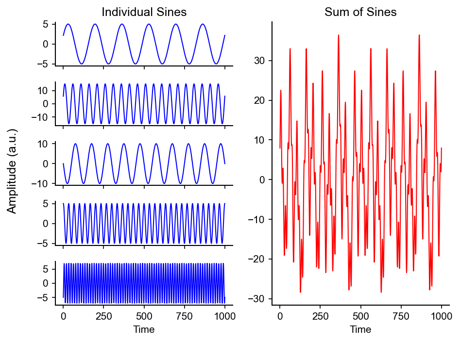
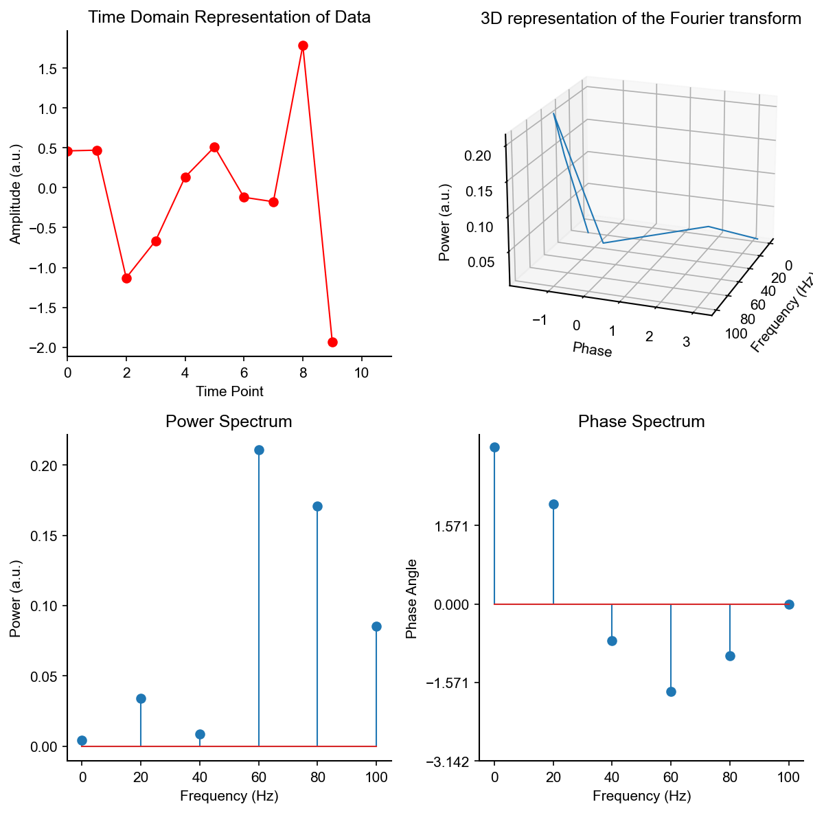
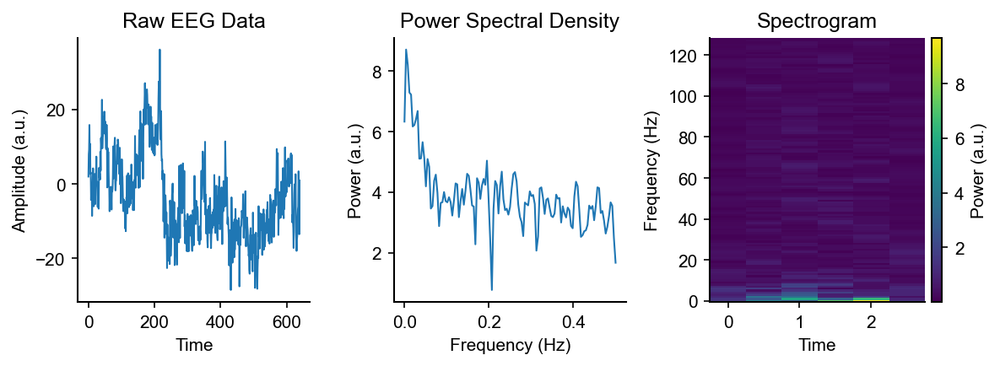
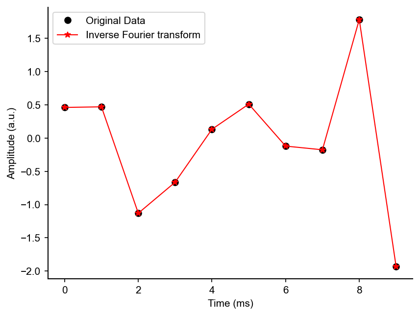

# Decomposing Fourier transforms: an introduction to time-frequency decomposition

<!-- <a href="https://www.wondersofphysics.com/2021/03/biography-of-joseph-fourier.html"></a> -->

<a href="https://www.wondersofphysics.com/2021/03/biography-of-joseph-fourier.html"></a>

([Picture](https://www.wondersofphysics.com/2021/03/biography-of-joseph-fourier.html) by [Wonders of Physics](https://www.wondersofphysics.com/), Public Domain)

The Fourier transform is one of many influential and revolutionary mathematics developed and discovered in the 19th century. In the 1800s, Jean-Baptiste Joseph Fourier claimed that perhaps any arbitrary function of a variable, whether continuous or discontinuous, can be expressed as a sum of sines and cosines. That is, perhaps an arbitrary time-dependent (or even space-dependent) signal \\(x (t)\\)$ can be expressed as a superposition, i.e., linear combination, of sine and cosine functions. This expression of a function as a sum of infintely many sines and cosines is [the Fourier series](https://mathworld.wolfram.com/FourierSeries.html)

Today, the Fourier transform is one of the most important algorithms in engineering, mathematics, physics, statistics, signal processing, and image and video processing. It is particularly important and useful for analyzing electrophysiological data like EEG, iEEG or ECoG, LFP, and MEG recordings.

The Fourier transform is valuable for two reasons:
1. It is a way to determine which frequencies are present in some temporal signal, or which wave lengths are present in some spatial pattern.
2. It is a straightforward way to solve many mathematical problems involving constant coefficient differential equations.

<b> But, most importantly, it transforms signal from the time (or spatial) domain to the frequency domain and back! <b>

The main result of the Fourier transform are Fourier coefficients used to compute a spectrum of power at various frequencies present in the signal: the power spectrum measures how strong is the contribution of frequencies present in the signal.

<!-- These recordings are simply signals that vary over time. The Fourier transform allows...transformation...of these signals from the time domain to the frequency domain, and back. -->

## Time domain \\(\leftrightarrow\\) frequency domain

Consider an arbitrary function or signal varying over time.

The time domain is each data point in time. The data is represented as a series of evenly spaced samples over time, collected at some sampling frequency. Neural time series is represented by its amplitude at each time point.

The frequency domain is sine functions for each frequency. The data in this domain is represented as waves with particular strengths and phases at different frequencies. This can be used to reconstruct the signal.

Below shows the relationship between the time domain and the frequency domain of a function based on its Fourier transform.

<a style="float:left; padding-right:10px" title="Lucas Vieira, Public domain, via Wikimedia Commons" href="https://commons.wikimedia.org/wiki/File:Fourier_transform_time_and_frequency_domains.gif"></a>

The Fourier transform takes an input function \\(\color{red}f\\) in the "time domain" and converts it into a new function \\(\color{blue}\hat{f}\\) in the "frequency domain".

$$\color{blue}{a_n \text{cos} (nx) + b_n \text{sin}(nx)}$$

In other words, the original function can be thought of as "amplitude given time", and the Fourier transform of the function is "amplitude given frequency".

Shown to the left is a 6-component approximation of the square wave decomposed into 6 sine waves. These component frequencies show as sharp peaks in the <span style="color:blue">frequency domain of the function</span>.

([GIF](https://commons.wikimedia.org/wiki/File:Fourier_transform_time_and_frequency_domains.gif#file) by [Lucas Vieira](https://commons.wikimedia.org/wiki/user:LucasVB), 23 February 2013. Public Domain, via [Wikimedia Commons](https://commons.wikimedia.org/wiki/Main_Page))

### A bit of math...the Fourier series and Euler's formula

#### The Fourier Series
If \\(\omega = 2 \pi / T = 2 \pi f\\) is the angular frequency \\(\omega\\) corresponding to the period \\(T\\) and frequency \\(f = 1/T\\), then the function \\(x(t)\\) can be written as a convergent infinite sum of sine and cosine functions each of period \\(T\\):

$$ \begin{aligned}
x(t) &= \frac{1}{2} a_0 + 
\begin{align} &a_1 \text{cos}(\omega t) + a_2 \text{cos}(2 \omega t) + · · · \\
&+ b_1 \text{sin}(\omega t) + b_2 \text{sin}(2 \omega t) + · · · \\
\end{align} \\
&= a_0 + \sum_{n=1}^{\infty} (a_n \text{cos}(n \omega t) + b_n \text{sin}(n \omega t)
\end{aligned} $$

where \\(a_n\\) and \\(b_n\\) are the Fourier coefficients. Alternatively, the Fourier series can be written in terms of complex exponentials.

#### Euler's Formula
Many mathematicians and scientists have expressed that Euler's formula and Euler's identity is the "most beautiful equation". It is defined as

$$\exp^{ix} = \text{cos}(x) + i \ \text{sin}(x),$$

where \\(x\\), or alternatively \\(\phi\\), is a real number and \\(i = \sqrt{-1}\\) is one of the two square roots of \\(-1\\).

Below in the visualization, \\(\exp^{i \phi}\\) is the unit circle in the complex plane for a real number \\(\phi\\). Here \\(\phi\\) is the angle between a line connecting the origin with a point on the unit circle makes and the positive real axis. The positive real axis is the \\(\text{cos} \phi\\) axis. Correspondingly, the real Fourier coefficients are the coefficients of the cosine.

#### Visually...

<a title="Original:  GuntherDerivative work:  Wereon, CC BY-SA 3.0 &lt;http://creativecommons.org/licenses/by-sa/3.0/&gt;, via Wikimedia Commons" href="https://commons.wikimedia.org/wiki/File:Euler%27s_formula.svg"></a>

([Image](https://commons.wikimedia.org/wiki/File:Fourier_transform_time_and_frequency_domains.gif#file) by [Gunther](https://commons.wikimedia.org/wiki/User:Gunther~commonswiki), 29 May 2006. [CC BY-SA 4.0](https://creativecommons.org/licenses/by-sa/4.0), via [Wikimedia Commons](https://commons.wikimedia.org/wiki/Main_Page))

Skipping some math...the signal of interest can be expressed as the following:

$$
x(t) = \sum_{-\infty}^{\infty} c_n \exp^{i n \omega t}
$$

where \\(c_n = a_n + i b_n\\) are the complex-valued Fourier coefficients.

Now, the power spectrum \\(P_n\\) is the magnitude squared of the complex Fourier coefficients such that

$$
P_n = {\lvert c_{n} \rvert}^2 = c_n c_{n}^* = a_{n}^{2} + b_{n}^{2}
$$

for \\(n = 0, 1, 2, \cdots .\\) which corresponds to the frequency \\(f_n = n/T\\) or angular frequency \\(\omega n = 2 \pi \omega /T\\). The power spectrum is plot as a function of frequency or angular frequency, plotting \\(P(f_n) = P_n\\).

### A bit of plots

<b>All code below is written in python and adapted from [Lyndon Duong's](https://github.com/lyndond) GitHub repository: [Python implementations of code in Analyzing Neural Time Series by Dr. Mike X. Cohen](https://github.com/lyndond/Analyzing_Neural_Time_Series) and follows [Mike X. Cohen's](https://mikexcohen.com/) book, [Analyzing Neural Time Series Data: Theory and Practice](https://github.com/mikexcohen/AnalyzingNeuralTimeSeries) (2014, MIT Press). These tutorials (originally written in MATLAB) are further explained and found in Dr. Mike X. Cohen's [data analysis lecturelets](https://mikexcohen.com/lectures.html) and on his [YouTube channel](https://www.youtube.com/channel/UCUR_LsXk7IYyueSnXcNextQ).<b>

The only dependencies needed for the following code are the following:
- [matplotlib](https://matplotlib.org/)
- [numpy](https://numpy.org/)
- [scipy](https://scipy.org/).


```python
import matplotlib
from matplotlib import pyplot as plt
import numpy as np
import scipy.io
```

I customize the style of my plots by updating the "runtime configuration parameters", [matplotlib's rcParams](https://matplotlib.org/stable/tutorials/introductory/customizing.html).


```python
matplotlib.rcParams.update(matplotlib.rcParamsDefault)
plt.rcParams.update({'font.family' : 'Arial',
                     'lines.linewidth': 1,
                     'figure.dpi': 150,
                     'savefig.dpi': 500,
                     'axes.spines.right': False,
                     'axes.spines.top': False,
                     'axes.edgecolor': 'k',
                     'axes.linewidth': 1,
                     'axes.grid': False,
                     'axes.autolimit_mode': 'data',
                     'savefig.format': 'svg'})
```

#### Multiple sines of different frequencies can be combined to make a more complex signal


```python
# Figure 11.2
srate = 500. #sampling rate in Hz

#create arrays of frequencies, amplitudes, and phases to plot
frex = np.array([3, 10, 5 ,15, 35])
amplit = np.array([5, 15, 10, 5, 7])
phases = np.pi*np.array([1/7., 1/8., 1., 1/2., -1/4.])
time = np.arange(-1,1 +1/srate,1/srate)

sine_waves = np.zeros([len(frex), len(time)])
for fi in range(len(frex)):
    sine_waves[fi,:] = amplit[fi] * np.sin(2*np.pi*frex[fi]*time+phases[fi])

#plot each sine wave individually
fig = plt.figure()
fig.supylabel("Amplitude (a.u.)")

for fi in range(len(frex)):
    plt.subplot(len(frex), 2, 2*(fi+1)-1)
    plt.plot(sine_waves[fi,:], linewidth=1, color='b')
    if fi == 0:
        plt.title("Individual Sines")
    if fi != len(frex)-1:
        ax = plt.gca()
        ax.axes.xaxis.set_ticklabels([])
    elif fi == len(frex)-1:
        ax = plt.gca()
        ax.set_xlabel("Time")
            
#plot the sum of all sum waves
plt.subplot(1,2,2)
plt.plot(np.sum(sine_waves,axis=0), color='r')
plt.tight_layout()    
_=plt.title("Sum of Sines")
_=plt.xlabel("Time")
```


    

    


```python
# Figure 11.3
plt.figure()
noise = 5 * np.random.randn(np.shape(sine_waves)[1])
plt.plot( np.sum(sine_waves,axis=0) + noise, color='r')
_=plt.title("Sum of Sines+White Noise")
plt.xlabel("Time")
plt.ylabel("Amplitude (a.u.)") ;
```


    

    


#### Adding two signals preserves information of both signals


```python
# Figure 11.4
time = np.arange(-1, 1+1/srate, 1/srate)

#create three sine waves
s1 = np.sin(2*np.pi*3*time)
s2 = 0.5 * np.sin(2*np.pi*8*time)
s3 = s1 + s2

s_list = [s1, s2, s3]  # throw them into a list to analyze and plot

#plot the sine waves
fig = plt.figure(constrained_layout=True)

(subfig1, subfig2) = fig.subfigures(2, 1) # create 2 subfigures, total 2x3
ax1 = subfig1.subplots(1, 3, sharex='col', sharey='row') # create 1x3 subplots on subfig1
ax2 = subfig2.subplots(1, 3, sharex='col', sharey='row') # create 1x3 subplots on subfig2

for i in range(3):
    ax1[i].plot(time, s_list[i], color='r')
    ax1[i].axis([0, 1, -1.6, 1.6])
    ax1[i].set_yticks(np.arange(-1.5, 2, .5))
    
    #numpy implementation of the fft
    f = np.fft.fft(s_list[i])/float(len(time))
    hz = np.linspace(0, srate/2., int(np.floor(len(time)/2.)+1)) # we only have resolution up to SR/2 (Nyquist theorem)
    ax2[i].bar(hz,np.absolute(f[:len(hz)]*2), color='b')
    ax2[i].axis([0, 11, 0, 1.2])
    ax2[i].set_xticks(np.arange(0, 11))

subfig1.suptitle("Time Domain")
subfig1.supxlabel("Time")
subfig1.supylabel("Amplitude (a.u.)")

subfig2.suptitle("Frequency Domain")
subfig2.supxlabel("Frequency (Hz)")
subfig2.supylabel("Power (a.u.)") ;
```


    

    


Here, two sines with different amplitudes and frequencies (from left to right: \\(1\\) and \\(0.5\\), and \\(3\\) and \\(8\\), respectively) are added together in the time domain. The relative "strength" of the frequencies present in the signal corresponding to sum of the two sines is resolved in the frequency domain.

#### Putting it all together: from signal to its power and phase spectrum


```python
# Figure 11.5
from mpl_toolkits.mplot3d import Axes3D
N = 10 #length of sequence
og_data = np.random.randn(N) #create random numbers, sampled from normal distribution
srate = 200 #sampling rate in Hz
nyquist = srate/2 #Nyquist frequency -- highest frequency you can measure the data

#initialize matrix for Fourier output

frequencies = np.linspace(0, nyquist, N//2+1)
time = np.arange(N)/float(N)

#Fourier transform is dot product between sine wave and data at each frequency
fourier = np.zeros(N)*1j #create complex matrix
for fi in range(N):
    sine_wave = np.exp(-1j *2 *np.pi*fi*time)
    fourier[fi] = np.sum(sine_wave*og_data)
    
fourier_og = fourier/float(N)

fig = plt.figure(figsize=(8,8))

plt.subplot(221)
plt.plot(og_data,"-ro",)
plt.xlim([0,N+1])
plt.ylabel('Amplitude (a.u.)')
plt.xlabel('Time Point')
plt.title("Time Domain Representation of Data")

ax = fig.add_subplot(222, projection='3d')
ax.plot(frequencies, np.angle(fourier_og[:N//2+1]), zs=np.absolute(fourier_og[:N//2+1])**2)
ax.view_init(20, 20)
ax.set_xlabel('Frequency (Hz)')
ax.set_ylabel('Phase')
ax.zaxis.set_rotate_label(False)
ax.set_zlabel('Power (a.u.)', rotation=90)
plt.title("3D representation of the Fourier transform")

plt.subplot(223)
plt.stem(frequencies, np.absolute(fourier_og[:N//2+1])**2, use_line_collection=True)
plt.xlim([-5, 105])
plt.xlabel("Frequency (Hz)")
plt.ylabel("Power (a.u.)")
plt.title("Power Spectrum")

plt.subplot(224)
plt.stem(frequencies, np.angle(fourier_og[:N//2+1]), use_line_collection=True)
plt.xlim([-5, 105])
plt.xlabel("Frequency (Hz)")
plt.ylabel("Phase Angle")
plt.yticks(np.arange(-np.pi, np.pi, np.pi/2.))

plt.title("Phase Spectrum")

plt.tight_layout()
```

    /var/folders/1q/g9xwc9k128101dg5z58dbhm40000gn/T/ipykernel_22564/3676337223.py:40: MatplotlibDeprecationWarning: The 'use_line_collection' parameter of stem() was deprecated in Matplotlib 3.6 and will be removed two minor releases later. If any parameter follows 'use_line_collection', they should be passed as keyword, not positionally.
      plt.stem(frequencies, np.absolute(fourier_og[:N//2+1])**2, use_line_collection=True)
    /var/folders/1q/g9xwc9k128101dg5z58dbhm40000gn/T/ipykernel_22564/3676337223.py:47: MatplotlibDeprecationWarning: The 'use_line_collection' parameter of stem() was deprecated in Matplotlib 3.6 and will be removed two minor releases later. If any parameter follows 'use_line_collection', they should be passed as keyword, not positionally.
      plt.stem(frequencies, np.angle(fourier_og[:N//2+1]), use_line_collection=True)


    

    


<!-- #### Manaul implementation of the Fourier transform = numpy implementation -->

<!-- ### Manual Fourier transform implementation = numpy implementation
# # Figure 11.7
# fft_data = np.fft.fft(data)/N

# fig, ax = plt.subplots(3, 1, figsize=(8,5))

# ax[0].plot(frequencies, np.absolute(fourier_og[:N//2+1])**2,'ko',markersize=8, linewidth=5)
# ax[0].plot(frequencies, np.absolute(fft_data[:N//2+1])**2,'r*-',markersize=1)
# ax[0].set(title='Power Spectrum', xlabel="Frequency (Hz)", ylabel="Power (a.u.)")

# #wrap the computed phase angles because +pi = -pi
# phase_manual = (np.angle(fourier[:N//2+1])  + np.pi) % (2 * np.pi ) - np.pi
# phase_fft = (np.angle(fft_data[:N//2+1])  + np.pi) % (2 * np.pi ) - np.pi

# ax[1].plot(frequencies, phase_manual, 'ko', markersize=8, linewidth=5)
# ax[1].plot(frequencies, phase_fft, 'r*-', markersize=1)
# ax[1].set(title='Phase Spectrum', xlabel='Frequency (Hz)', ylabel='Phase Angle')

# #below line is a little verbose, but it is just real(ifft(fft(data)))
# ifftData = np.real(np.fft.ifft(np.fft.fft(data)))

# ax[2].plot(reconstructed_data, 'ko', markersize=8, linewidth=5)
# ax[2].plot(ifftData,'r*-',markersize=1)
# ax[2].set(title='Data Reconstruction', ylabel='Amplitude (a.u.)', xlabel='Time (ms)')

# plt.legend(["Manual Fourier transform","Numpy FFT"])
# fig.tight_layout() -->

<!-- <br>
<details>
    <summary>
        <b>Properties of the Fourier transform:
        </b>
    </summary>
<br>
    - It is a linear transform: If $g(t)$ and $h(t)$ are two Fourier transforms given by $G(f)$ and $H(f)$ respectively, then the linear combination of the Fourier transforms can be easily calculated.
        
    - Time shift property: The Fourier transform of $g(t–a)$ for a real number $a$ that shifts the original function has the same amount of shift in the magnitude of the spectrum.

    - Modulation property: A function is modulated by another function when it is multiplied in time.
        
    - Parseval’s theorem: Fourier transform is unitary, i.e., the sum of square of a function $g(t)$ equals the sum of the square of its Fourier transform, $G(f)$.

    - Duality: If g(t) has the Fourier transform G(f), then the Fourier transform of G(t) is g(-f).

    https://www.techopedia.com/definition/7292/fourier-transform
</details> -->

## The Discrete Fourier Transform (DFT)

(The following is adapted from blog posts written by [Stuart Riffle](https://www.i-programmer.info/programming/theory/3758-understanding-the-fourier-transform.html) and [David Smith](https://www.r-bloggers.com/2014/01/the-fourier-transform-explained-in-one-sentence/).)

The Discrete Fourier Transform is applied to signal of finite duration discretized at some sampling frequency.

It is defined as

$$ \color{purple}{X}_{\color{lime}{k}} = \color{magenta}{\sum_{n=0}^{N-1}} \color{cyan}{x_{n}} \color{red}{e^{-{i} \color{orange}{2 \pi} \color{lime}{k} \color{magenta}{\frac{n}{N}}}} .$$

Where,
- \\(\color{purple} X\\) is <span style="color:purple">amplitude or energy</span>
- \\(\color{lime}{k}\\) is <span style="color:lime">frequency</span>
- \\(\color{cyan}{x_{n}}\\) is <span style="color:cyan">the signal</span>
- \\(\color{red}{e^i}\\) comes from Euler's formula
    - One can think of this complex exponential as <span style="color:red">rotation</span> of a point along the unit circle starting from (0, 1).
- \\(\color{orange}{2 \pi}\\) is the circumfrence of the unit circle 
    - One can think of this as rotating a point along <span style="color:orange">the full unit circle</span>.
- \\(\color{magenta}{\sum_{n=0}^{N-1}}\\) and \\(\color{magenta}{\frac{n}{N}}\\) is <span style="color:magenta">the sum and average of all points</span> in the signal


>As [Stuart Riffle](https://www.i-programmer.info/programming/theory/3758-understanding-the-fourier-transform.html) and [David Smith](https://www.r-bloggers.com/2014/01/the-fourier-transform-explained-in-one-sentence/) state:
>
>> "To find <span style="color:purple">the energy at</span> <span style="color:lime">a particular frequency</span>, <span style="color:red">spin</span> <span style="color:cyan">the signal</span> <span style="color:orange">around a circle</span> <span style="color:lime">at that frequency</span>, and <span style="color:magenta">average a bunch of points along that path</span>."

This is most efficiently computed using <b>Fast Fourier Transform (FFT) algorithms<b>.

## Important Considerations and Issues

There are a few considerations and issues of which to be aware when using Fourier transforms to analyze real data.

One must consider sampling frequency (often constrained by hardware and software), signal properties, and appropriate parameters to set given data.

### Aliasing

Aliasing is frequency ambiguity  in a power spectrum as a result of discretely sampling a continuous waveform.

The maximum sampling frequency $f_\max$ is called the Nyquist frequency given by

$$f_\max = \frac{1}{2 \Delta t} = \frac{1}{2 f_s}. $$

Frequencies above the Nyquist frequency do not disappear. They reappear as peaks in the power spectrum
at lower frequencies in the range \\(0 < f < f_max = 1/(2 \Delta t)\\).

<a style="float:left; padding-right:10px" title="Omnicron11, CC BY-SA 4.0 &lt;https://creativecommons.org/licenses/by-sa/4.0&gt;, via Wikimedia Commons" href="https://commons.wikimedia.org/wiki/File:FFT_aliasing_600.gif"></a>

The upper left animation depicts a sequence of sine. Each successive sine has a higher frequency than the previous. The "true" signals are also being sampled (<span style="color:blue">dots</span>) at a constant frequency \\(f_s\\).

The upper left animation shows the continuous Fourier transform of the sine. The single non-zero component, the actual frequency, means there is no ambiguity.

The lower right animation shows the discrete Fourier transform of just the available samples. The presence of two components means the samples can fit at least two different sines, one of which is the true frequency (the upper right animation).

The lower left animation uses the same <span style="color:orange">samples</span> and default reconstruction algorithm to produce lower-frequency sines.

([GIF](https://upload.wikimedia.org/wikipedia/commons/8/83/FFT_aliasing_600.gif) by [Omnicron11](https://commons.wikimedia.org/wiki/User:Omnicron11), 7 April 2021. [CC BY-SA 4.0](https://creativecommons.org/licenses/by-sa/4.0), via [Wikimedia Commons](https://commons.wikimedia.org/wiki/Main_Page))

### Stationarity

A <span style="color:olive">stationary signal</span> is a signal that has constant statistical properties, e.g., mean, variance, etc., over time.

Neural data is most definitely not stationary!

The power spectrum of a <span style="color:magenta">non-stationary signal</span> is less "sharp": it is more difficult to resolve what frequencies are present with what power at what time.


```python
## Effects of non-stationarity

# Figure 11.9
#create array of frequencies, amplitudes, and phases
frex = np.array([3,10,5,7])
amplit = np.array([5,15,10,5])
phases = np.pi*np.array([1/7.,1/8.,1,1/2.])

#create a time series of sequenced sine waves

srate = 500.
time = np.arange(-1,1+1/srate,1/srate)
stationary = np.zeros(len(time)*len(frex))
nonstationary = np.zeros(len(time)*len(frex))

for fi in range(len(frex)):
    #compute sine wave
    temp_sine_wave = amplit[fi] * np.sin(2*np.pi*frex[fi]*time+phases[fi])
    
    #enter into stationary time series
    stationary = stationary + np.tile(temp_sine_wave,(1,len(frex)))
    
    #optional change of amplitude over time
    temp_sine_wave *= time+1
    
    #start and stop indices for insertion of sine wave
    start_idx = fi * len(time)
    stop_idx = fi *len(time) + len(time)
    
    #enter into non-stationary time series
    nonstationary[start_idx:stop_idx] = temp_sine_wave

    
plt.figure()
plt.subplot(221)
plt.plot(stationary[0], color='olive')
plt.axis([0,stationary.shape[1],-30,30])
plt.title("Stationary Signal")
_,xticks=plt.xticks(np.arange(0,4000,500))
plt.setp(xticks,rotation=-45)
plt.xlabel("Time")
plt.ylabel("Amplitude (a.u.)")

plt.subplot(222)
plt.plot(nonstationary, color='m')
plt.xlim([1,len(nonstationary)])
plt.title("Non-stationary Signal")
_,xticks=plt.xticks(np.arange(0,4000,500))
plt.setp(xticks,rotation=-45)
plt.xlabel("Time")

frequencies = np.linspace(0,srate/2, len(nonstationary)//2+1)
fft_nonstationary = np.fft.fft(nonstationary)/len(nonstationary)
fft_stationary = np.fft.fft(stationary[0])/stationary.shape[1]

plt.subplot(212)
plt.plot(frequencies,np.absolute(fft_stationary[:len(frequencies)]*2),'olive')
plt.plot(frequencies,np.absolute(fft_nonstationary[:len(frequencies)]*2), 'm')
plt.xlim([0,np.max(frex)*2])
plt.xlabel("Frequency (Hz)")
plt.ylabel("Power (a.u.)")
plt.legend(["Power stationary","Power non-stationary"])

plt.tight_layout()
```


    

    


### Zero-padding

Adding zeros to the end of the signal adds more points in the time domain. This increases the frequency resolution, however, no new information is added.

Often one zero-pads to make the length of the signal (in terms of points) a power of two number. FFT algorithms work best, i.e., are most efficient, when the length of the signal or window is a power of two.

## The Continuous Fourier Transform

The continuous Fourier transform takes an input function \\(\color{red}{f(x)}\\) in the time domain and turns it into a new function, \\(\color{blue}{\hat{f}(\xi)}\\) in the frequency domain.

<a style="float:left; padding-right:10px"  title="Lucas Vieira, Public domain, via Wikimedia Commons" href="https://commons.wikimedia.org/wiki/File:Continuous_Fourier_transform_of_rect_and_sinc_functions.gif"></a>

In the first part of the animation, the Fourier transform (as defined above) is applied to [<span style="color:red">the rectangular function, rect</span>](https://en.wikipedia.org/wiki/Rectangular_function), returning [<span style="color:blue">the normalized sinc function, sinc</span>](https://en.wikipedia.org/wiki/Sinc_function).

<br>
<details>
    <summary>
        <b>Note: Mathematical Definitions of <span style="color:red">rect</span> and <span style="color:blue">sinc</span>:
        </b>
    </summary>
    <span style="color:red">The rect function</span> is defined as 
    $$\text{rect} \ x = \Pi(x) =
    \left\{
    \begin{array}{ll}
    0, & if \lvert x \rvert > \frac{1}{2} \\
    \frac{1}{2}, & if \lvert x \rvert = \frac{1}{2} \\
    1, & if \lvert x \rvert < \frac{1}{2}.\\
    \end{array}
    \right.
    $$
<br>
    <span style="color:blue">The sinc function</span> is defined as 
    $$\text{sinc} \ x = \frac{\text{sin} \pi x}{\pi x}.
    $$
</details>
<br>
In the second part, the transform is reapplied to <span style="color:blue">the normalized sinc function</span> to get back <span style="color:red">the rectangular function</span>.


([GIF](https://commons.wikimedia.org/wiki/File:Continuous_Fourier_transform_of_rect_and_sinc_functions.gif#file) by [Lucas Vieira](https://commons.wikimedia.org/wiki/user:LucasVB), 3 March 2013. Public Domain, via [Wikimedia Commons](https://commons.wikimedia.org/wiki/Main_Page))

It takes four iterations of the Fourier transform to get back to the original function.

<!-- However, in this particular example, and with this particular definition of the Fourier transform, <span style="color:red">the rectangular function</span> and <span style="color:blue">the normalized sinc function</span> are exact inverses of each other. Using other definitions would require four applications. A distorted <span style="color:red">rect</span> and <span style="color:blue">sinc</span> function would result in the intermediate steps. -->
<!-- 
This was done for simplicity, as to not have very tall and very wide intermediate functions, or the need for a very long animation, as per the animator's description. -->

In this example, no imaginary, i.e., sine components, are displayed. Only the real, i.e., cosine components, are displayed.

Overlaid on the <span style="color:red">time domain curve</span>, is a changing <span style="color:yellow">curve</span>. This is the approximation using <span style="color:blue">the components extracted from the frequency domain</span> "found" so far, i.e., <span style="color:blue">the cosines</span> sweeping the surface. 

The approximation is calculated by adding all the components, integrating along the entire surface, with the appropriate amplitude correction due to the specific Fourier transform and ranges used:

$$\color{blue}{\hat{f} \xi = {\int_{-\infty}^{\infty} f(x) \ {e^{ -{2 \pi} i x \xi}} \ dx}}$$

## The Short-time Fourier Transform (STFT)

The short-time Fourier transform is the Fourier transform computed over short time windows.

In short: 
1. The time series is broken up in to multiple segments. Each segment is **nperseg** samples long.
2. The segments overlap by **noverlap** samples. This is the number of points to overlap between segments. The **time resolution is then nperseg - noverlap**, i.e, the time distance between neighboring segments. It's often called the "hop size".
3. Segments are multiplied with **window**. Window and segment must have the same length.
4. An FFT is performed over the windowed segment. The length of the FFT must be equal or longer than that of the segment (otherwise you would be truncating samples). If the FFT length is longer, the data will be **zero-padded**. The **frequency resolution is the sample rate divided by the FFT length (not the segment length)**.

Overlap (or hop size) and FFT length allows changing the time and frequency resolution independently from each other and from the segment size.

The "standard" way of doing this is to use an FFT length that's equal to the segment length and an overlap of 50%.

<!-- https://youtu.be/8nZrgJjl3wc?t=91 -->

[](https://youtu.be/8nZrgJjl3wc?t=92)

### Time-frequency resolution tradeoff

When the window size is large, more wide, the frequency over time is enhanced for accurate measurement.
- Longer length, high frequency resolution, low time resolution

When the window size is small, more narrow, the signal time changes are enhanced for accurate measurement.
- Shorter length, good time resolution, poor frequency resolution

<a href="https://www.researchgate.net/figure/An-intuitive-explanation-of-the-trade-off-between-time-and-frequency-resolution-in-STFT_fig5_346510613"></a>

([Figure 6 from Ali and Saif-ur-Rehman et al., 2020](https://www.researchgate.net/publication/346510613_Improving_the_performance_of_EEG_decoding_using_anchored-STFT_in_conjunction_with_gradient_norm_adversarial_augmentation))

## Sample EEG Data

How does sample EEG data, and the power spectral density and spectrogram of sample EEG data look?

### Main problem: EEG data = many overlapping noisy signals


```python
from mpl_toolkits.axes_grid1 import make_axes_locatable
from scipy.signal import stft
from scipy.signal import welch

data = scipy.io.loadmat("sampleEEGdata.mat")
eegdata=np.squeeze(data["EEG"][0,0]["data"][46,:,0])
srate = float(data["EEG"][0,0]["srate"][0,0])

fig = plt.figure(figsize=(8,3))
plt.subplot(1,3,1)
plt.plot(eegdata)
_=plt.title("Raw EEG Data")
_=plt.xlabel("Time")
_=plt.ylabel("Amplitude (a.u.)")

plt.subplot(1,3,2)
freqs, psd = welch(eegdata)
plt.plot(freqs, np.log(psd))
_=plt.title("Power Spectral Density")
_=plt.xlabel("Frequency (Hz)")
_=plt.ylabel("Power (a.u.)")

f, t, Sxx = stft(eegdata, fs=srate, scaling='psd')
ax = plt.subplot(1,3,3)
im = plt.pcolormesh(t, f, np.abs(Sxx))
plt.title("Spectrogram")
plt.xlabel("Time")
plt.ylabel("Frequency (Hz)")
divider = make_axes_locatable(ax)
cax = divider.append_axes("right", size="5%", pad=0.05)
cbar = plt.colorbar(im, cax=cax)
cbar.set_label('Power (a.u.)')

plt.tight_layout()
```


    

    


## Sample Audio Data

How does sample audio data, and the power spectral density and spectrogram of sample audio data look?

### Main problem: audio data = many overlapping noisy signals and very non-stationary


```python
from scipy.io import wavfile
from scipy.io.wavfile import WavFileWarning
import warnings

audio_file = 'birdname_130519_113030.1.wav'

with warnings.catch_warnings():
    warnings.filterwarnings("ignore", category=WavFileWarning)
    fs, audio = wavfile.read(audio_file)

dur = len(audio)/fs
time = np.arange(0,dur,1/fs)

fig = plt.figure(figsize=(8,3))
plt.subplot(1,3,1)
plt.plot(time, audio)
_=plt.title("Audio Data")
_=plt.xlabel("Time (s)")
_=plt.ylabel("Amplitude (a.u.)")

plt.subplot(1,3,2)
# Pxx, freqs, line = plt.psd(audio, NFFT=512, Fs=fs/1000, noverlap=256, return_line=True) ;
freqs, psd = welch(audio, fs=fs, nperseg=512, noverlap=256)
# plt.plot(freqs/1000, np.sqrt(psd))
plt.semilogy(freqs/1000, np.sqrt(psd))
_=plt.title("Power Spectral Density")
_=plt.xlabel("Frequency (kHz)")
_=plt.ylabel("Power (a.u.)")

f, t, spec = stft(audio, fs=fs, nperseg=512, noverlap=256)
ax = plt.subplot(1,3,3)
im = plt.pcolormesh(t, f/1000, np.sqrt(np.abs(spec)))
# spectrum, freqs, t, im = plt.specgram(audio, NFFT=512, Fs=fs, noverlap=256, mode='psd')
plt.title("Spectrogram")
plt.xlabel("Time")
plt.ylabel("Frequency (kHz)")
divider = make_axes_locatable(ax)
cax = divider.append_axes("right", size="5%", pad=0.05)
cbar = plt.colorbar(im, cax=cax)
cbar.set_label('Power (a.u.)')

plt.tight_layout()
```


    

    


## The Inverse Fourier Transform (IFT)

The inverse Fourier transforms signal from the frequency domain to the time domain...literally the inverse of the Fourier transform!

Similar to the discrete Fourier transform, it is defined as

$$\color{cyan}{x_{n}} = \color{magenta}{\frac{1}{N} \sum_{n=0}^{N-1}} \color{purple}{X}_{\color{lime}{k}} \color{red}{e^i} \color{orange}{2 \pi} \color{lime}{k} \color{magenta}{\frac{n}{N}}$$

Notably, the Fourier transform and inverse Fourier transform are lossless, that is, no information is lost when transforming signal from the time to frequency domain and back!


```python
# Figure 11.6
N = 10 #length of sequence
time = np.arange(N)/float(N)
reconstructed_data = np.zeros(N)

for fi in range(N):
    #scale sine wave by fourier coefficient
    sine_wave = fourier_og[fi] * np.exp(1j *2 * np.pi * fi * time)
    
    
    #sum the sine waves together, and take only the real part
    reconstructed_data += np.real(sine_wave)
    
plt.figure()
plt.plot(og_data,'ko',linewidth=4)
plt.plot(reconstructed_data,'r-*')
_=plt.legend(["Original Data","Inverse Fourier transform"])
plt.xlabel("Time (ms)")
plt.ylabel("Amplitude (a.u.)") ;
```


    

    


```python

```
