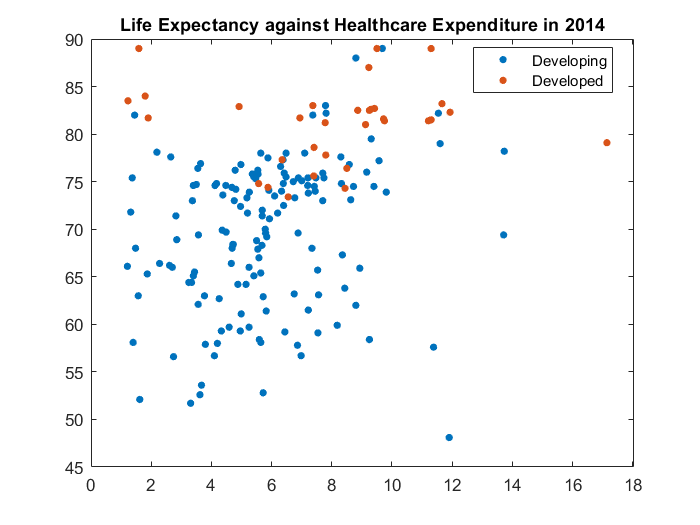
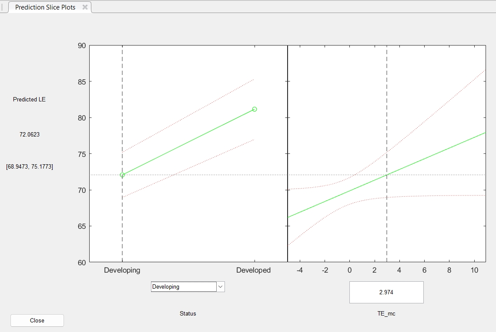

<style>
.bordered-table {
    border: 1px white solid;
    background-color: #00539B;
}

.bordered-table td {
    border: 1px white solid;
    padding: 10px;
}

.bordered-table th {
    border: 1px white solid;
    padding: 10px;
}

.bordered-table tbody tr:nth-child(odd) {
    background-color: #012169;
}
</style>


1.  [Why MATLAB?](#why)

2.  [Getting started](#start)

3.  [Data types](#basics)
    
    3.1 [Numeric types](#num)
    
    3.2 [Characters and Strings](#char)
    
    3.3 [Tables](#table)
    
    3.4 [Cell Arrays](#cell)
    
    3.5 [Structures](#struct)

4.  [Regression](#regression)

5.  [Conclusion](#conclusion)


<a id='why'></a>
## 1. Why MATLAB?

MATLAB is a proprietary programming language and computing enviorment developed by MathWorks. It is specifically desinged for engineers and scientists who work with data matrices of large sizes. Some of its advantages over other options (e.g., R, Python) include:

   -  having a graphical user interface (GUI) 
   -  (relatively) easy-to-understand data types 
   -  comprehensive tried-and-tested built-in functions 
   -  various toolboxes for brain research and beyond 

Here are some famous/useful packages that you'll likely come across in research:

{:.bordered-table}
| Name | Description |
| ---- | ----------- |
| [SPM](https://www.fil.ion.ucl.ac.uk/spm/software/spm12/) | one of the most popular packages for preprocessing and analyzing neuroimaging data, besides FSL and AFNI |
| [CONN](https://web.conn-toolbox.org/) | MATLAB- and SPM-based interactive toolbox for analyzing brain connectivity |
| [EEGLAB](https://eeglab.org/) | interactive toolbox for processing EEG, MEG, and other electrophysiological data |
| [FieldTrip](https://www.fieldtriptoolbox.org/) | non-interactive toolbox for processing MEG, EEG, and iEEG data |
| [PsychToolbox](http://psychtoolbox.org/) | toolbox for controling visual and auditory stimulus presentation |


And here are some previous DIBS Methods Meeting posts that included some MATLAB code snippets: 

   -  [Using the BIAC cluster](https://dibsmethodsmeetings.github.io/biac-cluster//) 
   -  [Multivariate pattern analysis](https://dibsmethodsmeetings.github.io/multivariate-pattern-analysis/) 
   -  [EEG Preprocessing using EEGLAB](https://dibsmethodsmeetings.github.io/eeg-analysis/)  

Hopefully this is just enough to convince you of the usefulness of MATLAB!


<a id='start'></a>
## 2. Getting started

If you haven't installed MATLAB or want to familiarize yourself with the GUI, please refer to [my earlier post on MATLAB basics](https://dibsmethodsmeetings.github.io/matlab-basics/). Alternatively, you can try out the online version here without the hassle of installation: [https://matlab.mathworks.com/.](https://matlab.mathworks.com)


<a id='basics'></a>
## 3. Data types

Data types and basic operations in MATLAB were covered in a bit more depths in [my earlier post](https://dibsmethodsmeetings.github.io/matlab-basics/), but we are going to to quickly review some important things here because they will come up later as we talk about regressions in MATLAB.


<a id='num'></a>
### Numeric types

There are several numeric types in MATLAB:

- double    Double-precision arrays (64-bit) <-- MATLAB default
- single    Single-precision arrays (32-bit)
- int8      8-bit signed integer arrays
- uint8     8-bit unsigned integer arrays

```matlab
class(1) % use the function `class` to check data types
```
```text
ans = 'double'
```

As mentioned before, one of the advantages of MATLAB is it's efficient handling of matrices or arrays, which we can easily assemble as below

```matlab
% use space or comma to separate columns
% use semicolon to separate rows
% use square brackets [ ] to put things together
a = [1    2,    NaN;
    .5    Inf   nan] 
```

This code defines a 2 x 3 (double) array:

```text
a = 2x3    
    1.0000    2.0000       NaN
    0.5000       Inf       NaN
```


<a id='char'></a>
### Characters and Strings

Both single and double quotes can be used for text data. While they are really interchangeable in Python and R, they have very difference functions in MATLAB. Single quotes `' '` create a sequence of characters, whereas double quotes `" "` create a complete piece string. 

```matlab
%%% use single quotes for characters
char1 = 'a';
char2 = 'abc';
%%% use double quotes for strings
str1 = "a";
str2 = "abc";
```

You can see the difference in the length of `'abc'` and `"abc"`.

```matlab
length(char2)
```
```text
ans = 3
```
```matlab
length(str2)
```
```text
ans = 1
```

Similar to numbers, text data can be assembled together into arrays, though it's more complicated with the distinction between characters and strings.

First, if we want to *concatenate* text,
```matlab
[char1 char2] % correctly concatenated character array
```
```text
ans = 'aabc'
```
```matlab
str1 + str2 % correctly concatenated strings
```
```text
ans = "aabc"
```

However, we cannot use addition for two characters
```matlab
char1 + char2 % data type converted to numeric for addition
```
```text
ans = 1x3    
   194   195   196
```


Neither can we use `[ ]` for concatenation of strings, as it will give use an array.


```matlab
[char1 str2] % character coerced to string
```
```text
ans = 1x2 string    
"a"          "abc"        
```


<a id='table'></a>
### Tables

Tables in MATLAB are similar to data frames in Python (Pandas) and R. They are really useful for data organization, and we will use them for regression analyses later. 

Let's define an example table in MATLAB with 2 rows and 2 columns.

```matlab
T = table;
T.col1 = [1; 2];
T.col2 = ["hello"; "world"];
T
```

{:.bordered-table}
| |col1|col2|
|:--:|:--:|:--:|
|1|1|"hello"|
|2|2|"world"|


When we add new data into an existing table, the dimensions must match.

```matlab
% dimensions must match
T.col3 = repmat(3, height(T), 1);
try T.col4 = 4; catch err; disp(err); end
```


```text
  MException with properties:

    identifier: 'MATLAB:table:RowDimensionMismatch'
       message: 'To assign to or create a variable in a table, the number of rows must match the height of the table.'
         cause: {}
         stack: [2x1 struct]
    Correction: []
```

Another thing that `table` enforces is data type. All entries in the same column must have the same data type, e.g., `string`.

```matlab
% data type must be consistent within each row
T.col2(2) = 1;
T % see how 1 is coerced into "1"
```

{:.bordered-table}
| |col1|col2|col3|
|:--:|:--:|:--:|:--:|
|1|1|"hello"|3|
|2|2|"1"|3|


```matlab
class(T.col2)
```
```text
ans = 'string'
```


<a id='cell'></a>
### Cell

`Cell` is another container data type that can be used to flexibly store data. It is flexible because there is no restriction on the data type that is stored in each cell. Let's define an example cell array with 3 rows and 2 columns. 

```matlab
% use curly brackets to put together things of different sizes and types
C = {42, "abcd"; table(nan), [1 2 3]; Inf, {}}
```

{:.bordered-table}
| |1|2|
|:--:|:--:|:--:|
|1|42|"abcd"|
|2|1x1 table|[1,2,3]|
|3|Inf|0x0 cell|


There are two ways to index a cell array, using `( )` or `{ }`.

```matlab
C(2) % paratheses indexing retrieves the cell 
```
```text
ans = 
    {1x1 table}

```
```matlab
C{2} % curly braces indexing retrieves the cell *content*
```

{:.bordered-table}
| |Var1|
|:--:|:--:|
|1|NaN|


As an aside, arrays are effcient, but we have to make sure that we access them in the correct order.

```matlab
% double arrays are indexed with parentheses
a = [11 12 13; 21 23 24]; % 2 x 3 double array
a
```
```text
a = 2x3    
    11    12    13
    21    23    24
```
```matlab
a(1, 2) % row 1, column 2
```
```text
ans = 12
```
```matlab
a(1:end, 2) % all rows, column 2
```
```text
ans = 2x1    
    12
    23
```
```matlab
a(2, :) % row 2, all columns
```
```text
ans = 1x3    
    21    23    24
```

Here's something that may seem odd -- we can actually access the entries with just one index.

```matlab
a(4) % 4th entry
```
```text
ans = 23
```

Let's look at how MATLAB interally stores the entries in this array.

```matlab
a(:) % all entries
```
```text
ans = 6x1    
    11
    21
    12
    23
    13
    24
```

In Python and R, array data is stored **row-wise**. In contrast, MATLAB arrays are stored **column-wise**, even though they are easily defined row-wise. 


┑(￣Д ￣)┍ 


<a id='struct'></a>
### Structures

This is probably the most versatile data type in MATLAB, and many complex functions and toolboxes make extensive uses of this data type. A `structure` can contain multiple `fields`, each of which can be of whatever data type.

```matlab
% group data using fields
% each field can be of any data type, including structures
S = struct;
S.field1_struct = struct;
S.field2_cell = C;
S.field3_table = T;
S.field4_char = char1;
S
```
```text
S = 
    field1_struct: [1x1 struct]
      field2_cell: {3x2 cell}
     field3_table: [2x3 table]
      field4_char: 'a'
```

After reviewing all these data types, we should be ready to fit some regression models in MATLAB! 


<a id='regression'></a>
## 4. Regression

Through the official [Statistics and Machine Learning Toolbox](https://www.mathworks.com/products/statistics.html), we have access to several built-in MATLAB functions for regression. 

First, let's load some example data. We are going to use an [open dataset on Kaggle on life expectancy](https://www.kaggle.com/datasets/kumarajarshi/life-expectancy-who). The original data came from the World Health Organization (WHO), who has been keeping track of the life expectancy and many other health factors of all countries. The final dataset consists of 20 predictor variables and 2938 rows, containing information for 193 countries between 2000 and 2015.


```matlab
data_table = readtable("2024-03-01-matlab-regression-Life-Expectancy.csv", ...
    "VariableNamingRule", "preserve"); % preserve white space in column names for readability
head(data_table);
```

```text
        Country        Year        Status        Life expectancy    Adult Mortality    infant deaths    Alcohol    percentage expenditure    Hepatitis B    Measles    BMI     under-five deaths    Polio    Total expenditure    Diphtheria    HIV/AIDS     GDP      Population    thinness  1-19 years    thinness 5-9 years    Income composition of resources    Schooling
    _______________    ____    ______________    _______________    _______________    _____________    _______    ______________________    ___________    _______    ____    _________________    _____    _________________    __________    ________    ______    __________    ____________________    __________________    _______________________________    _________

    {'Afghanistan'}    2015    {'Developing'}           65                263               62           0.01               71.28                65          1154      19.1            83             6            8.16               65          0.1       584.26    3.3736e+07            17.2                   17.3                        0.479                   10.1   
    {'Afghanistan'}    2014    {'Developing'}         59.9                271               64           0.01              73.524                62           492      18.6            86            58            8.18               62          0.1        612.7    3.2758e+05            17.5                   17.5                        0.476                     10   
    {'Afghanistan'}    2013    {'Developing'}         59.9                268               66           0.01              73.219                64           430      18.1            89            62            8.13               64          0.1       631.74    3.1732e+07            17.7                   17.7                         0.47                    9.9   
    {'Afghanistan'}    2012    {'Developing'}         59.5                272               69           0.01              78.184                67          2787      17.6            93            67            8.52               67          0.1       669.96     3.697e+06            17.9                     18                        0.463                    9.8   
    {'Afghanistan'}    2011    {'Developing'}         59.2                275               71           0.01              7.0971                68          3013      17.2            97            68            7.87               68          0.1       63.537    2.9786e+06            18.2                   18.2                        0.454                    9.5   
    {'Afghanistan'}    2010    {'Developing'}         58.8                279               74           0.01              79.679                66          1989      16.7           102            66             9.2               66          0.1       553.33    2.8832e+06            18.4                   18.4                        0.448                    9.2   
    {'Afghanistan'}    2009    {'Developing'}         58.6                281               77           0.01              56.762                63          2861      16.2           106            63            9.42               63          0.1       445.89    2.8433e+05            18.6                   18.7                        0.434                    8.9   
    {'Afghanistan'}    2008    {'Developing'}         58.1                287               80           0.03              25.874                64          1599      15.7           110            64            8.33               64          0.1       373.36    2.7294e+06            18.8                   18.9                        0.433                    8.7   
```

Let's validate the information in the description above.

```matlab
fprintf( ...
    "Number of rows = %d \n" + ...
    "Number of years = %d \n" + ...
    "Number of countries = %d \n", ...
    height(data_table), ...
    length(unique(data_table.Year)), ...
    length(unique(data_table.Country)));
```
```text
Number of rows = 2938 
Number of years = 16 
Number of countries = 193 
```

For simplicity, we are going to focus on the most recent complete sample (year 2014) and on the following variables:

   1. Life expectancy (in years) 
   2. Status: "Developed", "Developing" 
   3. Total expenditure: General government expenditure on health as a percentage of total government expenditure (%) 


```matlab
data_2014 = data_table(data_table.Year==2014, ["Country" "Status" "Total expenditure" "Life expectancy"]);
head(data_2014);
```
```text
            Country                Status        Total expenditure    Life expectancy
    _______________________    ______________    _________________    _______________

    {'Afghanistan'        }    {'Developing'}          8.18                59.9      
    {'Albania'            }    {'Developing'}          5.88                77.5      
    {'Algeria'            }    {'Developing'}          7.21                75.4      
    {'Angola'             }    {'Developing'}          3.31                51.7      
    {'Antigua and Barbuda'}    {'Developing'}          5.54                76.2      
    {'Argentina'          }    {'Developing'}          4.79                76.2      
    {'Armenia'            }    {'Developing'}          4.48                74.6      
    {'Australia'          }    {'Developed' }          9.42                82.7      
```

Before actually fitting regression models, let's make some plots.

```matlab
close all
figure
gscatter( ...
    data_2014.("Total expenditure"), ... x-axis
    data_2014.("Life expectancy"), ... y-axis
    data_2014.Status ... color
    );
title("Life Expectancy against Healthcare Expenditure in 2014")
```




We make 3 observations:

   1.  There are much fewer developed countries (orange) than developing countries (blue).  
   2.  Developed countries tend to have higher life expectancy than developing countries. 
   3.  Life expectancy MAYBE is positively correlated with heathcare expenditure for developing countries, but less so for developed countries. 


Now let's fit some linear regression models! 


We're going to use the [`fitlm`](https://www.mathworks.com/help/stats/linear-regression-model-workflow.html) function in MATLAB. This function provides very detailed outputs. 


```matlab
data_2014.Status = categorical(data_2014.Status, ["Developing" "Developed"]); %%% note the order
data_2014.LE = data_2014.("Life expectancy");
data_2014.TE = data_2014.("Total expenditure");
m1 = fitlm(data_2014, "LE ~ TE * Status");
% anova(m1, "component", 3) %%% Type III anova
m1 %%% regression coefficients and stats
```


```text
m1 = 
Linear regression model:
    LE ~ 1 + Status*TE

Estimated Coefficients:
                           Estimate      SE        tStat       pValue  
                           ________    _______    _______    __________

    (Intercept)              65.288     1.5208      42.93    1.6594e-95
    Status_Developed         15.824     3.6356     4.3525    2.2717e-05
    TE                      0.73836    0.24142     3.0584     0.0025709
    Status_Developed:TE    -0.73511    0.45121    -1.6292       0.10505

Number of observations: 181, Error degrees of freedom: 177
Root Mean Squared Error: 7.15
R-squared: 0.307,  Adjusted R-Squared: 0.295
F-statistic vs. constant model: 26.1, p-value = 5.11e-14
```


Note that it's critically important to know how to correctly interpret these results, e.g., what is the "Intercept" and whether "TE" is a simple effect or a main effect. See more in [Kevin's post on *Interpreting Regression Coefficients*](https://dibsmethodsmeetings.github.io/contrasts/). Briefly, the order of the categorical variable AND whether the continuous variable is mean-centered matters. Let's see:


```matlab
data_2014.Status_rev = categorical(data_2014.Status, ["Developed" "Developing"]);
data_2014.TE_mc = data_2014.TE - mean(data_2014.TE, "omitmissing");
m2 = fitlm(data_2014, "LE ~ TE_mc * Status");
m3 = fitlm(data_2014, "LE ~ TE_mc * Status_rev");
```

```matlab
m1.Coefficients
```

{:.bordered-table}
| |Estimate|SE|tStat|pValue|
|:--:|:--:|:--:|:--:|:--:|
|1 (Intercept)|65.2878|1.5208|42.9296|0|
|2 Status_Developed|15.8237|3.6356|4.3525|0|
|3 TE|0.7384|0.2414|3.0584|0.0026|
|4 Status_Developed:T...|-0.7351|0.4512|-1.6292|0.1050|


```matlab
m2.Coefficients
```

{:.bordered-table}
| |Estimate|SE|tStat|pValue|
|:--:|:--:|:--:|:--:|:--:|
|1 (Intercept)|69.8664|0.5929|117.8317|0|
|2 Status_Developed|11.2652|1.5557|7.2414|0|
|3 TE_mc|0.7384|0.2414|3.0584|0.0026|
|4 Status_Developed:T...|-0.7351|0.4512|-1.6292|0.1050|


```matlab
m3.Coefficients
```

{:.bordered-table}
| |Estimate|SE|tStat|pValue|
|:--:|:--:|:--:|:--:|:--:|
|1 (Intercept)|81.1316|1.4382|56.4102|0|
|2 Status_rev_Develop...|-11.2652|1.5557|-7.2414|0|
|3 TE_mc|0.0032|0.3812|0.0085|0.9932|
|4 Status_rev_Develop...|0.7351|0.4512|1.6292|0.1050|


Let's quickly plot the effects of TE (with 95% confidence intervals) on LE, separately for developed and developing countries. This is essentially doing `plot(ggemmeans(m, ~ TE + Status))` in R.


```matlab
plotSlice(m2); %%% alternative syntax: `m2.plotSlice;` 
```




However, If we need to fit a large number of models and don't really need detailed statistics from each model, we can use the [`regress`](https://www.mathworks.com/help/stats/regress.html) function to trade comprehensiveness for speed. 


```matlab
% define outcome variable
y = data_2014.LE;
% define predictor variables
X = nan(length(y), 4); %%% initialize 3 columns
X(:, 1) = 1; %%% constant term is NOT automatically put into the model!
X(:, 2) = double(data_2014.Status=="Developing"); %%% manually code the categorical variable
X(:, 3) = data_2014.("Total expenditure") - mean(data_2014.("Total expenditure"), "omitmissing");
X(:, 4) = X(:, 2) .* X(:, 3); %%% interaction term
[b, bint, r, rint, stats] = regress(y, X);
b
```


```text
b = 4x1    
   81.1316
  -11.2652
    0.0032
    0.7351
```


```matlab
m3.Coefficients
```

{:.bordered-table}
| |Estimate|SE|tStat|pValue|
|:--:|:--:|:--:|:--:|:--:|
|1 (Intercept)|81.1316|1.4382|56.4102|0|
|2 Status_rev_Develop...|-11.2652|1.5557|-7.2414|0|
|3 TE_mc|0.0032|0.3812|0.0085|0.9932|
|4 Status_rev_Develop...|0.7351|0.4512|1.6292|0.1050|


```matlab
all(m3.Coefficients.Estimate == b)
```


```text
ans = 
   1
```


Ta-da! As we can see the regression coefficients we obtained using `regress` are exactly the same as what we had from `fitlm` earlier, though we no longer have the nice-looking table filled with stats. However, the (very crude) test below shows that `regress` is indeed a lot faster than `fitlm`.


```matlab
tic
for i=1:500
    y = data_2014.LE;
    % define predictor variables
    X = nan(length(y), 4); %%% initialize 3 columns
    X(:, 1) = 1; %%% constant term is NOT automatically put into the model!
    X(:, 2) = double(data_2014.Status=="Developing"); %%% manually code the categorical variable
    X(:, 3) = data_2014.("Total expenditure") - mean(data_2014.("Total expenditure"), "omitmissing");
    X(:, 4) = X(:, 2) .* X(:, 3); %%% interaction term
    [b, bint, r, rint, stats] = regress(y, X);
end
toc
```
```text
Elapsed time is 0.201044 seconds.
```

```matlab
tic
for i=1:500
    m = fitlm(data_2014, "LE ~ TE_mc * Status_rev");
end
toc
```
```text
Elapsed time is 5.250400 seconds.
```

<a id='conclusion'></a>
## 5. Conclusion


We've made it to the end of MATLAB basics and regression (yay!), though this is just the tip of the iceberge of regression models out in the wild world, such as regularized regression, nonlinear regression, and mixed-effects regression. Feel free to check out how they are can be implemented in MATLAB [here](https://www.mathworks.com/help/stats/introduction-to-parametric-regression-analysis.html). 


Enjoying MATLAB-ing!
