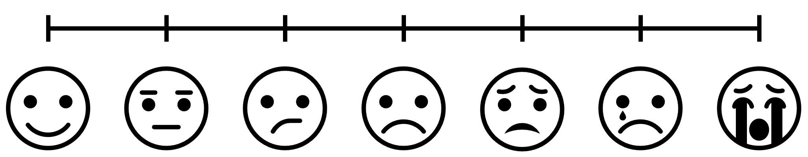
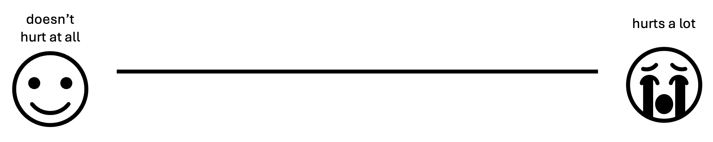

In psychology, we often find ourselves running experiments or surveys in
which participants are asked to respond on a numerical scale. For
example, we’re probably all familiar with pain scales like this at the
doctor’s office:



This classic scale is known as a 7-point ordinal scale (also called a
Likert scale after its inventor), since there are seven discrete
response options ordered by increasing levels of pain. Ordinal scales
give you a decent ability to measure people’s thoughts and feelings, but
often we as psychologists want more sensitive measurements. As a result,
it is becoming more and more popular these days to ditch the ordinal
scale for a *visual analog scale* (VAS):



The VAS achieves the same fundamental purpose as the ordinal scale, but
it allows respondents to click anywhere on the scale. Presumably, the
idea is that this allows participants to make as finer-grade
distinctions to better express their underlying psychological state.

As it turns out, VASs *do* typically have better measurement properties
than ordinal scales. However, they also tend to generate data that can
be problematic to analyze with conventional statistical tools. In this
post, we’ll discuss what is so difficult about VAS data, and then we’ll
build up step-by-step to a fancy new method of analyzing this kind of
data that solves all of our problems. This post assumes some familiarity
with `R` and introductory statistics, so if necessary now is a good time
to brush up on the basics. In contrast, if you just want the solution,
this post is based on the fantastic paper [Ordered Beta Regression: A
Parsimonious, Well-Fitting Model for Continuous Data with Lower and
Upper Bounds by Robert Kubinec](https://doi.org/10.1017/pan.2022.20).

<br>

Table of Contents:

1.  [The problem](#the-problem)
2.  [The “easy” way out](#the-easy-way-out)
    1.  [The Beta distribution](#the-beta-distribution)
    2.  [The zero-one-inflated Beta
        distribution](#the-zero-one-inflated-beta-distribution)
    3.  [Mo parameters mo problems](#mo-parameters-mo-problems)
3.  [The ordered Beta distribution](#the-ordered-beta-distribution)
    1.  [A reasonable psychological
        story](#a-reasonable-psychological-story)
    2.  [Logistic regression](#logistic-regression)
    3.  [Ordered logistic regression](#ordered-logistic-regression)
    4.  [Putting it all together](#putting-it-all-together)
4.  [Enough math, just tell me how to fit the darn
    thing](#enough-math-just-tell-me-how-to-fit-the-darn-thing)
    1.  [Starting simple](#starting-simple)
    2.  [Accounting for repeated
        measures](#accounting-for-repeated-measures)
    3.  [Thinking about variance](#thinking-about-variance)
5.  [Conclusions](#conclusions)

<br><br>

# The problem

I mentioned above that VASs tend to generate data that can be difficult
to analyze. To give you an idea of what I’m talking about, allow me to
use an example from my own research on how people make causal judgments.
In my studies, we present people with a story in which some outcome
happens and we ask participants the extent to which one preceding event
*caused* the outcome to occur. Here’s an example:

> Billy and Suzy are freight train conductors. One day, they happen to
> approach an old two-way rail bridge from opposite directions at the
> same time. There are signals on either side of the bridge. Billy’s
> signal is red, so he is supposed to stop and wait. Suzy’s signal is
> green, so she is supposed to drive across immediately.
>
> Neither of them realizes that the bridge is on the verge of collapse.
> If they both drive their trains onto the bridge at the same time, it
> will collapse. Neither train is heavy enough on its own to break the
> bridge, but both together will be too heavy for it.
>
> Billy decides to ignore his signal and drives his train onto the
> bridge immediately at the same time that Suzy follows her signal and
> drives her train onto the bridge. Both trains move onto the bridge at
> the same time, and at that moment the bridge collapses.

Given this story, we then ask participants *To what extent did Billy
driving onto the bridge cause it to collapse?* using a VAS ranging from
“not at all” to “totally”. Here are some data from exactly such an
experiment:


Since psychologists love normal distributions so much, the “standard”
way of analyzing data would be to slap a normal distribution on top of
this histogram. In mathematical notation, we’re assuming $$Y \sim
\mathcal{N}(\mu, \sigma)$$, where $$Y$$ is our data, $$\sim$$ means “is
distributed as”, and $$\mathcal{N}(\mu, \sigma)$$ is a normal
distribution with mean $$\mu$$ and standard deviation $$\sigma$$. Here’s
what that looks like:


As we can see, while the normal distribution (in red) captures some
important information about the data, it is a pretty poor approximation
of the data. Most obviously, the normal distribution allows for values
outside the range of the scale: it says that, with some probability,
participants have the ability to give a response of e.g. `1.1` or
`-258239`. Relatedly, it underestimates the number of responses at
exactly the scale bounds (i.e., the “not at all” or “totally”
responses”). Finally, it cannot account for the skew in the data, which
is typical in the presence of ceiling effects.

All of these things might sounds like overly-specific complaints. After
all, the normal distribution correctly estimates the mean and variance
of the data, which is usually enough for most purposes. But these
problems manifest when performing statistical inference: **even if your
estimates of the means and variances are correct, your standard errors
(and hence your *p*-values) will be wrong**. So, if you’re comparing
causal judgments across two separate conditions, you’ll be more inclined
to find a “significant” *p*-value even if there is no real difference
between conditions, and you’ll be more inclined to miss true differences
between conditions! Bad news indeed.

<br>

# The “easy” way out

Before I introduce my preferred method of dealing with this problem, I’m
going to walk you through a more general approach that *technically*
works, but has some problems of its own. As we will see, the model we
will end up with is a special case of this more general model. So, it
will help to have this framing in place.

## The Beta distribution

If you’re a statistical afficionado, you may have noticed that the main
problem is that while our data have upper and lower bounds, the normal
distribution is unbounded on either side. But there is a statistical
distribution with upper and lower bounds designed specifically for
modeling proportions: [the Beta
distribution](https://en.wikipedia.org/wiki/Beta_distribution)!
Specifically, to make this distribution easier to work with and think
about, we’ll use a reparameterization of the Beta distribution using a
mean parameter $$\mu$$ and an inverse variance (or precision) parameter
$$\phi$$. In mathematical notation, we are now assuming the model
$$Y \sim Beta(\mu\phi, (1-\mu)\phi)$$. Here are a few examples of this
distribution:


As one might expect, $$\mu$$ controls the mean of the distribution, so
$$\mu = .5$$ is perfectly centered on `.5`. $$\phi$$ controls the
precision, which means that higher values of $$\phi$$ result in
distributions with less variance. When $$0 < \phi \le 2$$, the resulting
distribution will typically be bimodal, and when $$2 <
\phi$$ the distribution will be unimodal. Since the Beta distribution is
relatively flexible and incorporates our bounded constraints, it’s going
to be an essential part of our slider scale models.

## The zero-one-inflated Beta distribution

The Beta distribution has one fatal flaw when it comes to slider data:
although it can model values arbitrarily close to `0` and `1`, it cannot
produce values exactly at those bounds. So, if we wanted to just use a
Beta distribution to model our slider data, we would have two
undesirable options. Either we can throw away all of our data at the
endpoints, or we can scale our data so that the upper and lower bounds
are just inside `0` and `1`. I want to stress that *both of these are
bad ideas*. What can we do instead?

The trick is that we can augment our Beta distribution by simply
slapping on a spike on each end of the scale. This approach is known as
zero-one-inflated Beta (or ZOIB), since we’re essentially sticking a
little inflatable tube man on each side of our Beta distribution (at
least, that’s what I like to imagine). To formalize the ZOIB
distribution, we’re going to use the following likelihood:

$$\mathrm{ZOIB}(Y \vert \mu, \phi, \pi_0, \pi_{01}, \pi_1) = \begin{cases}
    \pi_0, & y = 0 \\ 
    \pi_{01}\mathrm{Beta}(\mu\phi, (1-\mu)\phi), & 0 < y < 1 \\
    \pi_1, & y = 1
\end{cases}$$

Here, $$\pi_0$$ is the probability of a `0` response, $$\pi_1$$ is the
probability of a `1` response, and $$\pi_{01}$$ is the probability of a
response between `0` and `1`. Obviously, we require the additional
constraint that $$\pi_0 + \pi_1 + \pi_{01} = 1$$, since every response
must be a `0`, a `1`, or something in between. To make sure we don’t
violate that constraint, we can set these probabilities in terms of an
overall inflation probability $$\theta = \pi_0 + \pi_1$$ (the
probability of a `0` or `1` response), and a conditional inflation
probability $$\gamma = \frac{\pi_1}{\pi_0 + \pi_1}$$ (the probability of
a `1` response, given a response of `0` or `1`).

$$\mathrm{ZOIB}(Y \vert \mu, \phi, \theta, \gamma) = \begin{cases}
    \theta(1-\gamma), & y = 0 \\ 
    (1-\theta)\mathrm{Beta}(\mu\phi, (1-\mu)\phi), & 0 < y < 1 \\
    \theta\gamma, & y = 1
\end{cases}$$

To demonstrate how these parameters work, here is a plot of a ZOIB
distribution with $$\mu = .5$$, $$\phi = 5$$, and varying levels of
$$\theta$$ and $$\gamma$$.


Comparing across rows confirms that $$\theta$$ directly controls the
overall proportion of responses at the endpoints and comparing across
columns confirms that $$\gamma$$ controls the proportion of `1`’s out of
the responses at the endpoints.

## Mo parameters mo problems

It looks like we finally have arrived at a distribution that is flexible
enough to meet all of our requirements: we can model any response
between `0` and `1`, we can exclude values outside this range, we can
capture the mean, variance, and even higher moments like skew, and we
can capture distributions with many responses at the endpoints! Is there
anything that the ZOIB *can’t* do??

In theory, no: the ZOIB is your one-stop shop for your slider scale
data. In fact, if you would rather just fit a ZOIB model to your data, I
highly recommend [Matti Vuorre’s neat
tutorial](https://mvuorre.github.io/posts/2019-02-18-analyze-analog-scale-ratings-with-zero-one-inflated-beta-models/)
on fitting ZOIBs with the `brms` package in `R`. But, the inherent
complexity of the ZOIB distribution can present two major hurdles to its
use in practice. The first problem is that we’ve gone from a
distribution with two parameters (the normal distribution’s mean and
standard deviation) to a distribution with four parameters (the ZOIB’s
mean, precision, inflation probability and conditional inflation
probability). With more parameters comes more responsibility: you will
need a *lot* more data to fit a ZOIB distribution than a normal
distribution. This only gets worse when we think about adding predictors
to the model: even if we make the assumption of equal precisions across
conditions (analogous to the equal variance/homoskedasticity assumption
in the normal model), we still need enough data to fit three times as
many parameters as in the normal model. What’s more is that since the
inflation probability parameters are only informed by the binary
responses, your power for estimating these parameters will only scale
with the number of responses at the endpoints.

A related problem is that of interpretability. Let’s say you plan an
experiment comparing causal judgments across two conditions, and you
decide to spend a bunch of money to collect thousands of data points and
fit a proper ZOIB model. How do you tell if there is a significant
difference between conditions? The ZOIB distribution allows $$\mu$$,
$$\theta$$, and $$\gamma$$ to vary completely independently, meaning
that you can end up with weird cases in which an experimental treatment
increases $$\mu$$ but has no effect on $$\theta$$ and even decreases
$$\gamma$$. In cases like this, it can be difficult to tell whether the
experimental treatment increased judgments overall. This property of the
ZOIB confirms the worst fears of many experimentalists: doing stats “the
right way” can end up getting you lost in a never-ending nightmare in
which nothing is certain. Since we wouldn’t expect cases like this to
occur very often in practice (i.e., we expect correlations between
$$\mu$$, $$\theta$$, and $$\gamma$$), it would be nice to have some way
of limiting the possibility that they vary in opposing directions.

<br><br>

# The ordered Beta distribution

Thankfully, it turns out that both of the practical issues of the ZOIB
distribution can solved by constraining it to match our understanding of
human psychology. The solution, known as [the ordered Beta
distribution](https://doi.org/10.1017/pan.2022.20), was only recently
developed. But, it is rapidly gaining popularity and I now use it in
virtually all of my own research, since it captures the intricacies of
slider data while still being incredibly easy to use!

The explanation of the ordered Beta distribution given by the paper is
great. But, since the paper is more for statisticians/modelers, I’m
going to focus the remainder of this post in describing it in a way that
is hopefully more accessible to the average psychologist. So, I’m going
to rewind by telling a broad story about how people might make responses
on visual analog scales, and then build up step-by-step to the full
model.

## A reasonable psychological story

Until now, we have been so enamored with the problem of describing
slider scale data that we have completely ignored the fact that our data
*comes from somewhere*. Obviously, in the real world we collect slider
data by asking participants to respond to a question on the scale. As
psychologists, we hope that participants will think about each question
so deeply that they will respond at exactly the point that they have
decided reflects exactly their underlying beliefs. But the reality is
that your participants are probably just trying to be done with their
experiment so that they can get paid and go home. So it makes sense that
they probably cut some corners when it comes to making responses on
slider scales.

To make this more concrete, let’s imagine that people take a two-step
process when responding on slider scales. You can think of this as a
kind of [“system 1/system 2”-like
distinction](https://en.wikipedia.org/wiki/Thinking,_Fast_and_Slow) if
you like.

First, people use their gut instincts about the question to make a
three-alternative forced-choice decision to either:

1.  respond “no”
2.  respond “yes”
3.  take a second to make a finer-grained response

In many cases, the question will seem obvious enough that you can get
away with (1) or (2). And those people are already done! But still, some
people might be more careful about their responses. Those people will
have a second decision to make: given that the answer is neither a clear
“yes” or a clear “no”, exactly where is it between the two?

To be clear, this two-stage decision process is merely a guiding idea
that has (as far as I am aware) little to no evidence backing it up.
Still, we can use it as a way of structuring our generative model for
slider scale data. With this scaffold in mind, we can begin to build our
model back up from the ground!

## Logistic regression

Now that we have a general idea that slider scale data are a mixture of
two sequential decisions (i.e., a rapid yes/no decision and a
fine-grained continuous decision), we can start by focusing on the first
decision. I described this as a three-alternative decision. But before
we model all three choices, for simplicity’s sake let’s first pretend
that there are only two alternatives, “yes” and “no”.

Given a particular survey question, we can imagine that people represent
their gut instincts about that question using a continuous value sampled
from a distribution. We can assume a normal distribution, but for
technical reasons I’m going to assume that people’s gut instincts are
distributed according to a [logistic
distribution](https://en.wikipedia.org/wiki/Logistic_distribution) with
mean $$\mu^*$$ and a fixed scale $$s = 1$$ (we’ll see why I am using
$$\mu^*$$ instead of just $$\mu$$ shortly). An easy and optimal way to
convert this gut instinct into a binary “yes”/“no” response is to
compare it to a threshold $$\kappa$$:


Hopefully it’s clear from the picture above that any gut instincts to
the left of the threshold are treated as “no” responses (in gray) and
any gut instincts to the right of the threshold are treated as “yes”
responses. One can imagine that by decreasing $$\kappa$$ we will
increase the proportion of “yes” responses and by increasing $$\kappa$$
we will increase the proportion of “no” responses. Likewise, we can also
change the proportion of “yes” and “no” responses by keeping $$\kappa$$
fixed but moving the distribution around by changing $$\mu^*$$.

If this sounds at all familiar, it’s because what I’ve just described is
logistic regression! In logistic regression, we model binary responses
using a probability parameter that is rescaled as an unbounded variable:

$$\begin{align*}
Y &\sim Bernoulli(\pi) \\
\pi &= \textrm{logit}^{-1}(\mu^*-\kappa)
\end{align*}$$

Here the [Bernoulli
distribution](https://en.wikipedia.org/wiki/Bernoulli_distribution) is
just a distribution of “yes”/“no” responses with probability $$\pi$$ of
a “yes” response, and the inverse logit function
$$\textrm{logit}^{-1}(x)$$ computes the probability of a gut instinct
smaller than $$x$$. Ordinarily, it is not possible to estimate both
$$\mu^*$$ and $$\kappa$$, since there are many ways to set $$\mu^*$$ and
$$\kappa$$ to end up with the same $$\pi$$ (e.g., $$\mu^* = \kappa
= 0$$ and $$\mu^* = \kappa = 1$$ both result in $$\pi = .5$$). So,
you’ll often see models that fix either $$\mu^*$$ or $$\kappa$$ (but not
both) to 0. For example, in standard [logistic
regression](https://en.wikipedia.org/wiki/Logistic_regression), it is
customary to set $$\kappa = 0$$ so that $$\mu^*$$ is interpretable as
the log-odds of a “yes” response. By contrast, in [signal detection
models](https://dibsmethodsmeetings.github.io/signal-detection/), it is
customary to set $$\mu = 0^*$$ so that $$\kappa$$ is interpretable as
the degree of response bias. As you will see, in our case, it will make
sense to treat $$\mu^*$$ and $$\kappa$$ separately.

## Ordered logistic regression

Returning to our two-stage psychological process for slider data, it
should be apparent that what we need is a way to make three-alternative
choices, not two-alternative choices. Thankfully, we can adapt our
logistic regression model to generate three alternatives simply by
adding a second threshold! Here is a diagram illustrating the basic
idea:


Just as before, we’re splitting up the distribution of gut instincts to
produce a fixed number of responses. The only difference is that now we
have two thresholds $$\kappa_0$$ and $$\kappa_1$$ (where
$$\kappa_0 < \kappa_1$$), which jointly determine the proportion of each
of the three responses. In formal mathematical notation, we have the
model:

$$\begin{align*}
Y &\sim Categorical(\pi_0, \pi_{01}, \pi_1) \\
\pi_0 &= 1 - \textrm{logit}^{-1}(\mu^*-\kappa_0) \\
\pi_{01} &= \textrm{logit}^{-1}(\mu^*-\kappa_0) - \textrm{logit}(\mu^*-\kappa_1) \\
\pi_1 &= \textrm{logit}^{-1}(\mu^*-\kappa_1)
\end{align*}$$

Again, this is mathematically the same model as before, except now with
two thresholds to generate three possible responses. If the
$$\textrm{logit}^{-1}$$ equations seem daunting, just know that all
they’re doing is ensuring that the shaded areas of each color get sorted
to the correct response option.

This model ([the ordered logistic or ordinal regression
model](https://dibsmethodsmeetings.github.io/ordinal-regression/)) is
less well-known than the logistic regression model. But, it’s also
gaining popularity in psychology for its ability to model ordinal scale
data (remember the Likert pain scale from the Introduction?), since a
7-point ordinal scale seems to be the default in psychology. But in our
case, we only need three options, and so this ordinal model perfectly
suits our needs!

Returning once again to our two-stage psychological model of slider
data, we now have a complete statistical description of the first stage:
people have a logistically-distributed gut instinct that they threshold
into either a “no” response, a “yes” response, or a decision to spend
more effort and make a finer-grained response. So, now all we need is a
model of the second stage in which people make that finer-grained
distinction.

## Putting it all together

If you’ve been following along diligently, you’ll have noticed that we
already have introduced a distribution that models values between `0`
and `1`: the Beta distribution! Moreover, since we already have a
parameter $$\mu^*$$ describing people’s average gut instinct, we can
re-use that parameter such that $$\mu = \textrm{logit}^{-1}(\mu^*)$$ (or
$$\mu^* = \textrm{logit}(\mu)$$) for our Beta distribution! Putting all
of the pieces together, we end up with the ordered Beta distribution:


As you can see, the ordered Beta distribution beautifully captures the
two-stage response process I described above: first, people make a
decision whether to make a quick qualitative response or a slower
fine-grained response, and second those that decided to spend more time
resolve their judgment quantitatively. Below is the mathematical
notation for the ordered Beta likelihood:

$$\begin{align*}\mathrm{OrderedBeta}&(Y \vert \mu, \phi, \kappa_0, \kappa_1) = \\
&\begin{cases}
    1 - \textrm{logit}^{-1}(\textrm{logit}(\mu)-\kappa_0), & y = 0 \\ 
    \left[\textrm{logit}^{-1}(\textrm{logit}(\mu)-\kappa_0) - \textrm{logit}^{-1}(\textrm{logit}(\mu)-\kappa_1)\right]\mathrm{Beta}(\mu\phi, (1-\mu)\phi), & 0 < y < 1 \\
    \textrm{logit}^{-1}(\textrm{logit}(\mu)-\kappa_1), & y = 1
\end{cases}
\end{align*}$$

Let’s compare this to the ZOIB model from before:

$$\mathrm{ZOIB}(Y \vert \mu, \phi, \pi_0, \pi_{01}, \pi_1) = \\
\begin{cases}
    \pi_0, & y = 0 \\ 
    \pi_{01}\mathrm{Beta}(\mu\phi, (1-\mu)\phi), & 0 < y < 1 \\
    \pi_1, & y = 1
\end{cases}$$

As you can see, our new ordered Beta distribution is just a ZOIB model
in which we have set $$\pi_0$$, $$\pi_{01}$$, and $$\pi_1$$ using our
ordinal thresholds $$\kappa_0$$ and $$\kappa_1$$ in relation to the mean
parameter $$\mu$$. If the ordered Beta is just a certain kind of ZOIB
model, what makes it any better? Well, since the inflation probabilities
also depend on $$\mu$$, it is much more reasonable to assume that the
thresholds $$\kappa_0$$ and $$\kappa_1$$ are fixed. Together with the
assumption of equal precision across conditions, we now have only a
single parameter that uniquely determines the mean of our distribution:
$$\mu$$! In particular, we can calculate the mean of the ordered Beta
like so:

$$\begin{align*}
\mathbb{E}[Y] &= \pi_0 0 + \pi_{01}\mu + \pi_1 1 \\
&= \pi_{01}\mu + \pi_1 \\
&= \left[\textrm{logit}^{-1}(\textrm{logit}(\mu)-\kappa_0) - \textrm{logit}^{-1}(\textrm{logit}(\mu)-\kappa_1)\right]\mu + \textrm{logit}^{-1}(\textrm{logit}(\mu)-\kappa_1) \\
\end{align*}$$

This equation tells us that the mean slider response increases
non-linearly but monotonically as a function of $$\mu$$, meaning that we
can directly interpret $$\mu$$ as an indicator of people’s overall
response. This property makes the ordered Beta not only much easier to
fit than the full ZOIB, but also much easier to interpret!

<br>

# Enough math, just tell me how to fit the darn thing

Now that we have a decent enough understanding of the ordered Beta
distribution, it’s time to use it on some real data! I’ll demonstrate
how to use the
[`ordbetareg`](https://cran.r-project.org/web/packages/ordbetareg/index.html)
package, which provides a familiar `lmer`-like API by wrapping the
`brms` Bayesian regression package, which is itself a wrapper for the
[Stan probabilistic programming language](https://mc-stan.org).

As an aside, this methods perform approximate Bayesian inference
(although it is likely possible in principle to fit an ordered Beta
regression under a frequentist paradigm). If this is new to you, I would
recommend [brushing up on the
basics](https://dibsmethodsmeetings.github.io/bayes/) before proceeding.
For brevity, I will not cover how to set priors for Bayesian models in
this post. I will just note that the default priors provided by
`ordbetareg` are weak and reasonable, so although it might be helpful to
set more informative priors in practice, these priors will not strongly
bias your parameter inference.

## Starting simple

As I mentioned earlier, the `ordbetareg` package makes it incredibly
easy to fit ordered Beta distributions to your data! First, let’s load
the package and check out our data:

``` r
library(ordbetareg)

d.cause
```

    ## # A tibble: 354 × 4
    ##           id vignette condition cause
    ##        <dbl> <chr>    <fct>     <dbl>
    ##  1 718177348 Bu       Abnormal   0.96
    ##  2 718177348 C        Abnormal   1   
    ##  3 718177348 S        Abnormal   1   
    ##  4 718177348 W        Normal     0.59
    ##  5 382027122 B        Normal     0.81
    ##  6 382027122 Bu       Normal     0.7 
    ##  7 382027122 D        Normal     0.84
    ##  8 382027122 W        Normal     0.92
    ##  9 345754483 Bu       Normal     0.66
    ## 10 345754483 Cof      Normal     0.43
    ## # ℹ 344 more rows

As a reminder, this is an experiment looking at causal judgments in
response to a vignette in which two factors jointly cause an outcome
(e.g., in the vignette above, two trains drive onto a bridge resulting
in its collapse).

Here `id` is a randomly-generated participant number, `vignette` is a
label for the particular story presented to participants, `condition`
refers to whether the event being judged was abnormal (e.g., in our
train vignette, whether the train operator drove through a red light),
and `cause` is the participants’ causal judgment of that event on a
scale from `0` (not at all causal) to `1` (totally causal). Based on the
snippet above, we can see that each participant provided multiple
responses, and many participants provided responses to each vignette.

To start, let’s fit an ordered Beta distribution to our causal judgments
allowing $$\mu$$ to vary by `condition`:

``` r
m.condition <- ordbetareg(cause ~ condition, data=d.cause, cores=4)
summary(m.condition)
```

    ##  Family: ord_beta_reg 
    ##   Links: mu = identity; phi = identity; cutzero = identity; cutone = identity 
    ## Formula: cause ~ condition 
    ##    Data: data (Number of observations: 354) 
    ##   Draws: 4 chains, each with iter = 2000; warmup = 1000; thin = 1;
    ##          total post-warmup draws = 4000
    ## 
    ## Regression Coefficients:
    ##                   Estimate Est.Error l-95% CI u-95% CI Rhat Bulk_ESS Tail_ESS
    ## Intercept             0.26      0.07     0.12     0.39 1.00     3915     2637
    ## conditionAbnormal     0.69      0.10     0.49     0.90 1.00     3970     2182
    ## 
    ## Further Distributional Parameters:
    ##         Estimate Est.Error l-95% CI u-95% CI Rhat Bulk_ESS Tail_ESS
    ## phi         3.81      0.30     3.24     4.41 1.00     3602     2465
    ## cutzero    -2.97      0.32    -3.63    -2.38 1.00     2572     2630
    ## cutone      1.57      0.07     1.43     1.70 1.00     2529     2542
    ## 
    ## Draws were sampled using sampling(NUTS). For each parameter, Bulk_ESS
    ## and Tail_ESS are effective sample size measures, and Rhat is the potential
    ## scale reduction factor on split chains (at convergence, Rhat = 1).

This function call uses the syntax `cause ~ condition` to say that we
are predicting `cause` using `condition` as a predictor. The argument
`cores=4` allows us to fit the model in parallel to save a few seconds.
In the summary above, `Regression Coefficients` refers to our parameters
predicting $$\mu$$ on the logit scale: `Intercept` is the estimate of
$$\textrm{logit}(\mu)$$ for the normal condition, and
`conditionAbnormal` is the relative increase in $$\textrm{logit}(mu)$$
for the abnormal condition. Since `Intercept` is above `0`, we can infer
that mean causal judgments for the normal condition are above the
midpoint of `0.5`. And since `conditionAbnormal` is above `0`, we can
infer that causal judgments are higher on average in the abnormal
condition compared to the normal condition.

Looking further, `phi` is just the estimate of $$\phi$$, and `cutzero`
and `cutone` are the estimates of $$\kappa_0$$ and $$\kappa_1$$, where
`cutzero` = $$\kappa_0$$ and `cutone` is on a transformed scale such
that $$\kappa_1 = \textrm{cutzero} + e^\textrm{cutone}$$.

In addition to looking at the estimated model parameters, there are
usually two things we want. First, we want to know the predicted mean
causal judgment (with appropriate uncertainty estimates). Second, we
want to simulate data from this model to ensure that we are describing
our data well. The `tidybayes` package makes both of these things easy!
Let’s first look at mean causal judgment per condition:

``` r
library(tidybayes)
library(modelr)

draws.epred <- d.cause %>%
    data_grid(condition) %>%
    add_epred_draws(m.condition)

draws.epred
```

    ## # A tibble: 8,000 × 6
    ## # Groups:   condition, .row [2]
    ##    condition  .row .chain .iteration .draw .epred
    ##    <fct>     <int>  <int>      <int> <int>  <dbl>
    ##  1 Normal        1     NA         NA     1  0.623
    ##  2 Normal        1     NA         NA     2  0.614
    ##  3 Normal        1     NA         NA     3  0.610
    ##  4 Normal        1     NA         NA     4  0.605
    ##  5 Normal        1     NA         NA     5  0.626
    ##  6 Normal        1     NA         NA     6  0.624
    ##  7 Normal        1     NA         NA     7  0.614
    ##  8 Normal        1     NA         NA     8  0.598
    ##  9 Normal        1     NA         NA     9  0.638
    ## 10 Normal        1     NA         NA    10  0.611
    ## # ℹ 7,990 more rows

In `tidybayes`, `epred` is a shorthand for the `e`xpectation of the
posterior `pred`ictive distribution. In other words, it just means the
mean causal judgment. We can see that `draws.epred` is a tidy dataframe
with one row per draw (or sample) from the posterior distribution. To
get a posterior summary, we can do the following:

``` r
median_hdi(draws.epred)
```

    ## # A tibble: 2 × 8
    ##   condition  .row .epred .lower .upper .width .point .interval
    ##   <fct>     <int>  <dbl>  <dbl>  <dbl>  <dbl> <chr>  <chr>    
    ## 1 Normal        1  0.617  0.578  0.656   0.95 median hdi      
    ## 2 Abnormal      2  0.787  0.753  0.820   0.95 median hdi

We can see that causal judgments are indeed higher on average in the
abnormal than the normal condition! Next, let’s simulate causal
judgments from this model:

``` r
draws.pred <- d.cause %>%
    data_grid(condition) %>%
    add_predicted_draws(m.condition)

draws.pred
```

    ## # A tibble: 8,000 × 6
    ## # Groups:   condition, .row [2]
    ##    condition  .row .chain .iteration .draw .prediction
    ##    <fct>     <int>  <int>      <int> <int>       <dbl>
    ##  1 Normal        1     NA         NA     1       1    
    ##  2 Normal        1     NA         NA     2       0.681
    ##  3 Normal        1     NA         NA     3       0.187
    ##  4 Normal        1     NA         NA     4       0.264
    ##  5 Normal        1     NA         NA     5       0.659
    ##  6 Normal        1     NA         NA     6       1    
    ##  7 Normal        1     NA         NA     7       1    
    ##  8 Normal        1     NA         NA     8       0.717
    ##  9 Normal        1     NA         NA     9       0.781
    ## 10 Normal        1     NA         NA    10       0.592
    ## # ℹ 7,990 more rows

Compared to the mean causal judgment code, we’ve only changed our
function call from `add_epred_draws` to `add_predicted_draws`. Again, we
have a tidy dataframe with one row per sample of our posterior, except
now we have a column `.prediction` containing simulated causal judgments
from our model. Let’s plot it next to the raw data and compare:

``` r
ggplot(draws.pred) +
    stat_slab(aes(x=cause), density='histogram', breaks=100, data=d.cause) +
    stat_slab(aes(x=.prediction), density='histogram', breaks=100, fill=NA, color='black') +
    xlab('Causal Judgment') +
    facet_grid(condition ~ .) +
    coord_fixed(ratio=1/3) +
    theme_classic(18) +
    theme(axis.title.y=element_blank(),
          axis.ticks.y=element_blank(),
          axis.text.y=element_blank(),
          axis.line.y=element_blank())
```


In this plot, the raw data are shown in gray and the model-simulated
judgments are shown in black. Clearly the model is not perfect (e.g.,
the model overestimates the number of `1`’s in the normal condition and
underestimates the number of middling judgments in both conditions), but
it does capture most of the important features of the data!

## Accounting for repeated measures

In the previous model we ignored the fact that we are repeatedly
sampling from multiple vignettes and participants, which can be an issue
since we expect judgments about the same vignette and judgments from the
same participant to be correlated. We can account for this information
by including vignette-level and participant-level effects, and
thankfully the `ordbetareg` package also makes it easy to do this!

``` r
m.multilevel <- ordbetareg(cause ~ condition + (1|id) + (condition|vignette), data=d.cause, cores=4)
summary(m.multilevel)
```

    ##  Family: ord_beta_reg 
    ##   Links: mu = identity; phi = identity; cutzero = identity; cutone = identity 
    ## Formula: cause ~ condition + (1 | id) + (condition | vignette) 
    ##    Data: data (Number of observations: 354) 
    ##   Draws: 4 chains, each with iter = 2000; warmup = 1000; thin = 1;
    ##          total post-warmup draws = 4000
    ## 
    ## Multilevel Hyperparameters:
    ## ~id (Number of levels: 78) 
    ##               Estimate Est.Error l-95% CI u-95% CI Rhat Bulk_ESS Tail_ESS
    ## sd(Intercept)     0.36      0.10     0.16     0.55 1.00     1176     1416
    ## 
    ## ~vignette (Number of levels: 9) 
    ##                                  Estimate Est.Error l-95% CI u-95% CI Rhat
    ## sd(Intercept)                        0.14      0.11     0.01     0.41 1.00
    ## sd(conditionAbnormal)                0.51      0.22     0.17     1.06 1.00
    ## cor(Intercept,conditionAbnormal)    -0.24      0.52    -0.96     0.84 1.00
    ##                                  Bulk_ESS Tail_ESS
    ## sd(Intercept)                        1898     2299
    ## sd(conditionAbnormal)                1421     1753
    ## cor(Intercept,conditionAbnormal)     1000     1785
    ## 
    ## Regression Coefficients:
    ##                   Estimate Est.Error l-95% CI u-95% CI Rhat Bulk_ESS Tail_ESS
    ## Intercept             0.31      0.10     0.11     0.52 1.00     3340     2409
    ## conditionAbnormal     0.76      0.22     0.32     1.22 1.00     2010     2023
    ## 
    ## Further Distributional Parameters:
    ##         Estimate Est.Error l-95% CI u-95% CI Rhat Bulk_ESS Tail_ESS
    ## phi         4.45      0.40     3.70     5.26 1.00     3530     3136
    ## cutzero    -3.00      0.32    -3.67    -2.43 1.00     4660     2984
    ## cutone      1.60      0.07     1.47     1.73 1.00     4528     3072
    ## 
    ## Draws were sampled using sampling(NUTS). For each parameter, Bulk_ESS
    ## and Tail_ESS are effective sample size measures, and Rhat is the potential
    ## scale reduction factor on split chains (at convergence, Rhat = 1).

This model formula looks similar to the previous one, except now we have
a section for `Multilevel Hyperparameters` which governs the (normal)
distribution of parameters per vignette and per participant. Again we
see that `Intercept` and `conditionAbnormal` are both reliably above
`0`. Let’s use `tidybayes` to get some means:

``` r
draws.epred <- d.cause %>%
    data_grid(condition) %>%
    add_epred_draws(m.multilevel, re_formula=NA)

draws.epred.id <- d.cause %>%
    data_grid(condition, id) %>%
    add_epred_draws(m.multilevel, re_formula=~(1|id))

draws.epred.id %>%
    median_qi() %>%
    mutate(id=factor(id, levels=m.multilevel %>%
                             spread_draws(r_id[id,term]) %>%
                             median_qi %>%
                             arrange(r_id) %>%
                             pull(id))) %>%
    ggplot(aes(x=id, y=.epred, ymin=.lower, ymax=.upper, color=condition)) +
    geom_rect(aes(ymin=.lower, ymax=.upper, xmin=-Inf, xmax=Inf), inherit.aes=FALSE,
              fill='grey90', data=draws.epred %>% median_hdi()) +
    geom_hline(aes(yintercept=.epred), data=draws.epred %>% median_hdi()) +
    geom_pointrange(position=position_dodge(.5), show.legend=FALSE) +
    xlab('Participant') +
    scale_y_continuous('Mean Causal Judgment', limits=0:1, expand=c(0, 0)) +
    scale_color_manual(values=c('#5D74A5FF', '#A8554EFF')) +
    facet_grid(~ condition) +
    theme_classic(18) +
    theme(axis.text.x=element_blank(),
          axis.ticks.x=element_blank())
```


In the code above, `draws.epred` gets the mean causal judgment per
condition for a hypothetical average participant and vignette (i.e.,
setting all participant-level and vignette-level effects to `0`).
`draws.epred.id` does the same thing, but it does so separately per
participant. The plot reveals that although there is a consistent effect
of normality on causal judgments overall (the black lines), there are
considerable participant-level differences (the points). You might also
note that since we don’t include participant-level effects of condition
due to sample size constraints, the effect of condition is estimated to
be the same across all participants. We can go through the same process
for individual vignettes:

``` r
draws.epred.vignette <- d.cause %>%
    data_grid(condition, vignette) %>%
    add_epred_draws(m.multilevel, re_formula=~(condition|vignette))

draws.epred.vignette %>%
    median_qi() %>%
    mutate(vignette=factor(vignette,
                           levels=m.multilevel %>%
                               spread_draws(r_vignette[vignette,term]) %>%
                               filter(term=='Intercept') %>%
                               median_qi %>%
                               arrange(r_vignette) %>%
                               pull(vignette))) %>%
    ggplot(aes(x=vignette, y=.epred, ymin=.lower, ymax=.upper, color=condition)) +
    geom_rect(aes(ymin=.lower, ymax=.upper, xmin=-Inf, xmax=Inf), inherit.aes=FALSE,
              fill='grey90', data=draws.epred %>% median_hdi()) +
    geom_hline(aes(yintercept=.epred), data=draws.epred %>% median_hdi()) +
    geom_pointrange(position=position_dodge(.5), show.legend=FALSE) +
    xlab('Vignette') +
    scale_y_continuous('Mean Causal Judgment', limits=0:1, expand=c(0, 0)) +
    scale_color_manual(values=c('#5D74A5FF', '#A8554EFF')) +
    facet_grid(~ condition) +
    theme_classic(18) +
    theme(axis.text.x=element_blank(),
          axis.ticks.x=element_blank())
```


Here it looks like most vignettes have similar ratings in the normal
condition, but they vary a lot in terms of the abnormal condition.
Finally, let’s simulate judgments for our experiment to check our model
fit:

``` r
draws.pred <- d.cause %>%
    add_predicted_draws(m.multilevel, ndraws=10)

ggplot(draws.pred) +
    stat_slab(aes(x=cause), density='histogram', breaks=100, data=d.cause) +
    stat_slab(aes(x=.prediction), density='histogram', breaks=100, fill=NA, color='black') +
    xlab('Causal Judgment') +
    facet_grid(condition ~ .) +
    coord_fixed(ratio=1/3) +
    theme_classic(18) +
    theme(axis.title.y=element_blank(),
          axis.ticks.y=element_blank(),
          axis.text.y=element_blank(),
          axis.line.y=element_blank())
```


Again, the model is not doing perfectly but it is capturing the most
important features of the data.

## Thinking about variance

The model above does everything you would normally want of a descriptive
statistical model for slider data: it produces data that looks
qualitatively like slider ratings, it can reliably estimate overall
differences in responses using a single parameter ($$\mu$$), and so it
is relatively easy to interpret!

Still, sometimes it is also important to look at changes in the
*variability* of responses in addition to changes in the mean. As a
bonus, let’s try this on our causal judgment data! To do this, we can
add regressors not just for $$\mu$$, but also for $$\phi$$. In
`ordbetareg`, this is pretty easy:

``` r
m.phi <- ordbetareg(bf(cause ~ condition + (1|id) + (condition|vignette),
                       phi ~ condition + (condition|vignette)),
                    data=d.cause, cores=4, phi_reg='both')
summary(m.phi)
```

    ##  Family: ord_beta_reg 
    ##   Links: mu = identity; phi = log; cutzero = identity; cutone = identity 
    ## Formula: cause ~ condition + (1 | id) + (condition | vignette) 
    ##          phi ~ condition + (condition | vignette)
    ##    Data: data (Number of observations: 354) 
    ##   Draws: 4 chains, each with iter = 2000; warmup = 1000; thin = 1;
    ##          total post-warmup draws = 4000
    ## 
    ## Multilevel Hyperparameters:
    ## ~id (Number of levels: 78) 
    ##               Estimate Est.Error l-95% CI u-95% CI Rhat Bulk_ESS Tail_ESS
    ## sd(Intercept)     0.34      0.09     0.17     0.51 1.00     1137     1273
    ## 
    ## ~vignette (Number of levels: 9) 
    ##                                          Estimate Est.Error l-95% CI u-95% CI
    ## sd(Intercept)                                0.20      0.12     0.01     0.48
    ## sd(conditionAbnormal)                        0.53      0.23     0.18     1.10
    ## sd(phi_Intercept)                            0.64      0.26     0.27     1.27
    ## sd(phi_conditionAbnormal)                    0.47      0.31     0.02     1.18
    ## cor(Intercept,conditionAbnormal)            -0.39      0.46    -0.98     0.75
    ## cor(phi_Intercept,phi_conditionAbnormal)    -0.58      0.43    -0.99     0.65
    ##                                          Rhat Bulk_ESS Tail_ESS
    ## sd(Intercept)                            1.00     1071     1191
    ## sd(conditionAbnormal)                    1.00      965     1345
    ## sd(phi_Intercept)                        1.01     1206     2105
    ## sd(phi_conditionAbnormal)                1.01      943     1108
    ## cor(Intercept,conditionAbnormal)         1.01      724     1186
    ## cor(phi_Intercept,phi_conditionAbnormal) 1.00     1817     1854
    ## 
    ## Regression Coefficients:
    ##                       Estimate Est.Error l-95% CI u-95% CI Rhat Bulk_ESS
    ## Intercept                 0.35      0.11     0.12     0.57 1.00     2466
    ## phi_Intercept             1.62      0.26     1.14     2.19 1.00     1306
    ## conditionAbnormal         0.75      0.22     0.33     1.20 1.00     1723
    ## phi_conditionAbnormal    -0.17      0.26    -0.69     0.34 1.00     2089
    ##                       Tail_ESS
    ## Intercept                 2904
    ## phi_Intercept             1655
    ## conditionAbnormal         2012
    ## phi_conditionAbnormal     2045
    ## 
    ## Further Distributional Parameters:
    ##         Estimate Est.Error l-95% CI u-95% CI Rhat Bulk_ESS Tail_ESS
    ## cutzero    -2.96      0.31    -3.58    -2.37 1.00     3203     3014
    ## cutone      1.60      0.07     1.47     1.73 1.00     3150     3058
    ## 
    ## Draws were sampled using sampling(NUTS). For each parameter, Bulk_ESS
    ## and Tail_ESS are effective sample size measures, and Rhat is the potential
    ## scale reduction factor on split chains (at convergence, Rhat = 1).

This summary looks just like the summary for our previous model, but now
with more parameters. Our new parameters for $$\phi$$ are prefixed with
`phi_`, and have similar interpretations as the coefficients for
$$\mu$$. However, since $$\phi$$ can be any number above `0`, these
coefficients are estimated on the log scale (and so reflect changes in
$$\textrm{log}(\phi)$$ rather than just $$\phi$$). Since
`phi_conditionAbnormal` is close enough to `0` relative to its
uncertainty, we can say that in this case there likely aren’t major
differences in variance between the normal and abnormal conditions. Just
to be sure, we can plot our estimated values of $$\phi$$ per vignette
just like we did for mean causal judgment above (I didn’t include
participant-level estimates of $$\phi$$ because there are only a few
responses per participant):

``` r
draws.phi <- d.cause %>%
    data_grid(condition) %>%
    add_linpred_draws(m.phi, dpar='phi', transform=TRUE, re_formula=NA)

draws.phi.vignette <- d.cause %>%
    data_grid(condition, vignette) %>%
    add_linpred_draws(m.phi, dpar='phi', transform=TRUE, re_formula=~(1|vignette))

draws.phi.vignette %>%
    median_qi(phi) %>%
    mutate(vignette=factor(vignette,
                           levels=m.phi %>%
                               spread_draws(r_vignette__phi[vignette,term]) %>%
                               median_qi %>%
                               filter(term == 'Intercept') %>%
                               arrange(r_vignette__phi) %>%
                               pull(vignette))) %>%
    ggplot(aes(x=vignette, y=phi, ymin=.lower, ymax=.upper, color=condition)) +
    geom_rect(aes(ymin=.lower, ymax=.upper, xmin=-Inf, xmax=Inf), inherit.aes=FALSE,
              fill='grey90', data=draws.phi %>% median_hdi(phi)) +
    geom_hline(aes(yintercept=phi), data=draws.phi %>% median_hdi(phi)) +
    geom_pointrange(position=position_dodge(.5), show.legend=FALSE) +
    xlab('Vignette') +
    scale_y_continuous('Phi', expand=c(0, 0), limits=c(0, NA)) +
    scale_color_manual(values=c('#5D74A5FF', '#A8554EFF')) +
    facet_grid(~ condition) +
    theme_classic(18) +
    theme(axis.text.x=element_blank(),
          axis.ticks.x=element_blank())
```


Just like the previous plots for mean causal judgment, this plot shows
that individual vignettes do differ to a reasonable degree with respect
to variance in causal judgments. Depending on your research goals, this
can be pretty informative: for example, if your goal is to isolate
stimuli that maximize participant agreement, then you might want to
choose vignettes with high values of $$\phi$$. In contrast, if you are
looking for vignettes which maximize participant *disagreement*, then
stimuli with low $$\phi$$ would be ideal. If you don’t really care
either way but you have enough data to estimate differences in phi
across vignettes, then including these parameters is a great way to help
make sure that your inferences about mean causal judgment are
well-calibrated.

<br>

# Conclusions

For those of you who have made it to the end of this post, congrats! As
we have seen, properly dealing with slider data takes a lot of thought
and effort, and it is a sizable undertaking to work through the ordered
Beta distribution in the name of accurate and interpretable statistics.

After discussing why traditional normal models are inappropriate for
slider data, we built up a complex alternative (the ZOIB distribution)
that works in theory but can be difficult to use and interpret in
practice. But, by backtracking to a general psychological story about
how people might make slider scale responses, we could piece together a
constrained version of the ZOIB distribution–the ordered Beta
distribution–that has all of the benefits of the ZOIB distribution
without any of the practical issues. Finally, thanks to the helpful
`ordbetareg` package, we showed that ordered Beta regressions are about
as easy to fit and interpret as the traditional normal models that
psychologists are used to fitting.

Hopefully this post has been useful for all of your slider scale needs!
For more information, I definitely recommend looking at the
[`ordbetareg`
vignette](https://cran.r-project.org/web/packages/ordbetareg/vignettes/package_introduction.html)
which provides more information on using the package.

Until next time!
