Psychological constructs can be approached through many levels of analyses. For instance, common in the field is to assess broad aggregations of behavior (e.g., self-report questionnaires). However, there has been a large push to examine situation-specificity in psychology given that, well, psychological processes can vary significantly by context. One way to sharpen this lens is to go to the *qualitative* level of analysis, wherein participants aren't just choosing researcher-imposed options or averaging across their life experiences, but they are **generating** raw signals of their current thoughts and states. Here is where qualitative data can come super handy!

## The many pros (and some cons) of qualitative data 

Besides allowing us to collect data on a very minute level of analysis, what benefits do qualitative data have?

* **Easy for participant**: Sometimes the easiest thing to do (for a participant, and for humanity at large) is yap, not to engage in metacognition or self-reflection. Unfiltered, raw, straight from the source.
* **Closer to construct of interest**: Relatedly (depending on your field), this directness stays closer to the construct of interest. For example, emotion regulation superstar James Gross once said that "*the descriptive approach elicits reports of behavior ... [which] has the advantage of staying close to the phenomenon of interest.*"
* **Targets a novel mechanism**: Most of psychology relies on search and/or selection mechanisms (e.g., memory recollection, ratings). With qualitative data, we leverage a **generative** mechanism, which is rich and often novel to the field.
* **Schema availability**: By asking participants to generate ideas, we often learn what schemas, or categories of thought, are readily available to them. This can give insight into, e.g., clinical perspectives.

<p align="center">
  
</p>

Okay, but what are some issues with using qualitative data?

* **Non-finiteness**: Qualitative data is inherently infinite, requiring thoughtful coding.
* **Researcher load**: Yes, we are easing the load on the participant, but we are moving that effort to the researcher to be able to analyze.
* **Variability in data quality**: The response types you are dealing with are now coming straight from the participant, so you are trusting them to type words correctly, etc. Note: there are data-cleaning pipelines available though.
* **The danger of LLMs**: Although there are ways to prevent/limit this, having a free-response box makes it super easy for participants to cheat in an online design because they can just put the prompt into ChatGPT and paste the response.


## Methodology in practice: Types of free-response questions and paradigms

### Divergent-thinking tasks

The creativity literature loves a good open-ended question. Divergent-thinking tasks are specifically adapted for this by giving a central prompt from which participants generate diverse ideas: "Come up with as many ways to do X." These tasks can be adapted across domains, including in emotion regulation (see below from my dissertation):

<p align="center">
  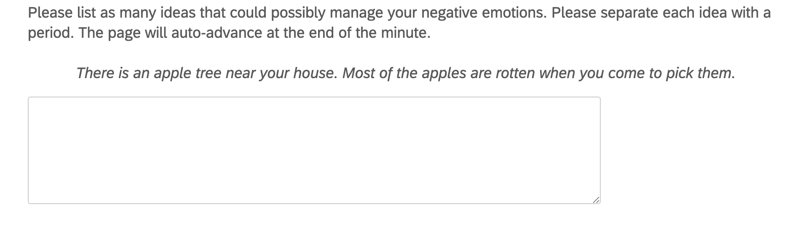
</p>

### Verbal fluency tasks

In a given time limit (usually 1-2 minutes), participants are asked to list every possible idea they can think of in a certain category. Commonly used is the Animal Fluency Task.

<p align="center">
  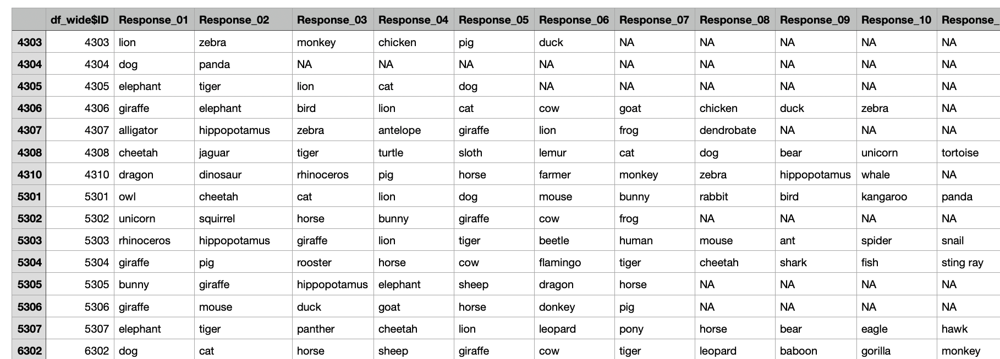
</p>

### Word association tasks

These tasks ask participants to list single words sequentially to determine the dynamics of their freely moving thoughts. For example, see below from [Andrews Hanna et al. (2022)](https://byeollux.github.io/pdfs/2021_AndrewsHanna.pdf)

<p align="center">
  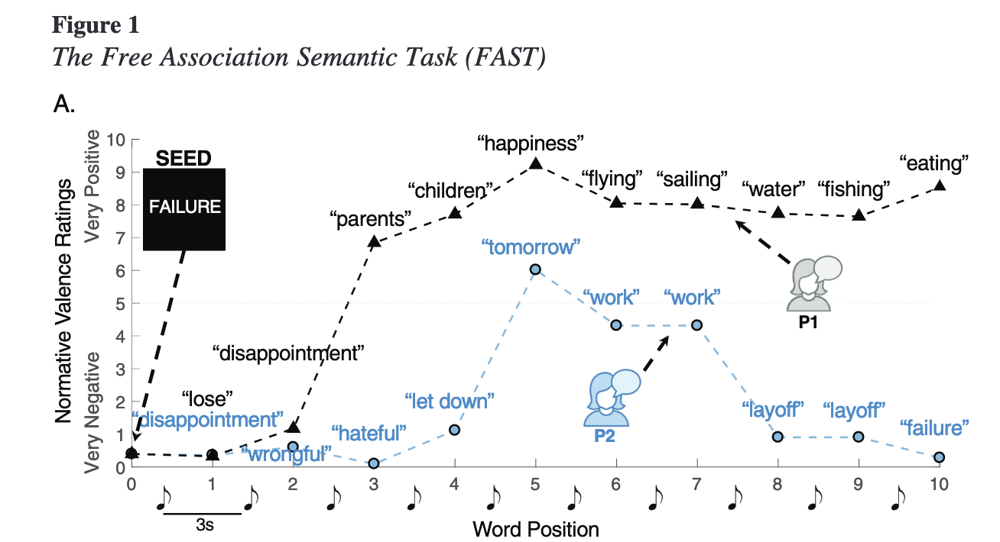
</p>

### Stories

Also taking from the creativity literature, you can ask participants to write full sentences and even narratives. These can be coded with natural language processing (something I will touch on later) or manually looking for common themes across responses.

### The "other" option

Quite literally, this is the "other" option, in that you may have a multiple choice question that a participant can't neatly fit in, so you give an "other" option with a free-response box for elaboration. This is common in demographic forms, for example (though in these cases, be sure to call it "Not listed").

### Any other domain-specific question you're interested in!

For example, "list your favorite memory", "generate a positive reappraisal of this situation", "how do you feel today"?


## Data Cleaning

### Manually 

Cleaning qualitative data can be tedious. Manually, this involves checking for full responses (which can be an issue if you have a page with auto-progression), typos that you can feasibly understand, and making sure participants understood the prompt.

You want to be careful not to make unilateral decisions - a reviewer may dislike that. Instead (related to the next section), you should recruit a team of raters (at least 2) to help you. Make rules (**AND PREREGISTER!**) about what your data-cleaning process will look like. For example, I made a rule that if at least one of my raters did not understand the response, it would be omitted from data analysis.

Below is a snippet of a conversation I recently had with a reviewer who tried to get me on this:

<p align="center">
  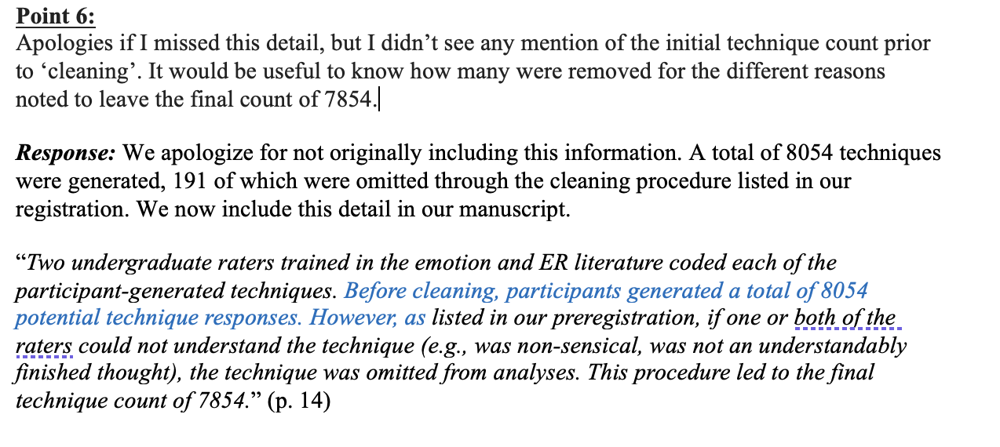
</p>

### Automatedly

Thankfully, for certain tasks, there are automated ways to clean text data! Yay! In particular, word-association task and fluency tasks have automated pipelines.

Most data cleaning techniques rely on something called *dictionaries*, which are sets of words against which your participants' data are checked. Here is a phenomenal description of dictionaries from a paper describing a package called SemNet: [Christensen & Kennett, 2022](https://d1wqtxts1xzle7.cloudfront.net/117887177/download-libre.pdf?1725259271=&response-content-disposition=inline%3B+filename%3DSemantic_Network_Analysis_SemNA_A_Tutori.pdf&Expires=1763060862&Signature=efAQfSaG6za~PWqFLGRZW5vub7k0Q1Cj9ipe8xvfgxniCdAGM6aDjG-mfZixdinnavMjOnYNiAOh1rTcRTtIjeuTye1rdy61sEIyThEa35HPp0M3HHw5zx46Y7JlKsrIUY8I-ochCNpejT5YWmW-OyRnCSOxMYYqSWrPbyl~qm00kDjuyfUFY6JV6Z2pAJbkMYBQOO1suFPW-UNKqQ6KW7CzKK2pJxfKMblcijx7Md1njuLJJJiqaSr1SIsr4ymG8E5a3xIHsymi-hpwWc0R9Iao8MevglytEo4txs5rCZBuLU4SZBPlkNazo41t2qgsdqRG18Q5UXt7vl8QWehtTQ__&Key-Pair-Id=APKAJLOHF5GGSLRBV4ZA).  

Basically, if the inputted data doesn't match what is in a dictionary because of a typo (e.g., "burd" instead of "bird"), the dictionary will apply spell-check and auto-correct. If the dictionary is totally unable to understand the word, some packages (including SemNet) will ask you to go through each flagged word to ask you if you want to change it to match a word in the dictionary. Otherwise, you can throw it out. Additionally, some packages like SemNet offer you the option to put in your own custom dictionary if you're looking for specific words!

In SemNet, there are several pre-set dictionaries to choose from: animals, fruit, jobs, vegetables, etc. Below is code I use on my animal fluency task, along with images showing multiple steps of the process.

```Rmd
#install.packages(c('SemNetDictionaries', 'SemNetCleaner'), dependencies = c('Imports', 'Suggests'))
# Load packages
## SemNetCleaner automatically loads SemNetDictionaries
library(SemNetCleaner)

## CLEANING SCRIPT
# load data
full <- read_excel('raw_animal_data.xlsx')
colnames(full) <- c('ID', 'response')
# get rid of non-letters
full$response <- gsub("-", "", full$response)

# make wide
df_wide <- full %>%
  group_by(ID) %>%
  mutate(response_number = row_number()) %>%
  pivot_wider(
    names_from = response_number,
    values_from = response,
    names_prefix = "response_",
    values_fill = NA
  )

# clean data
clean <- textcleaner(data = df_wide, partBY = 'row', dictionary = 'animals')

# subset the cleaned data from the output
clean_df <- as.data.frame(clean$responses$clean)
```

<p align="center">
  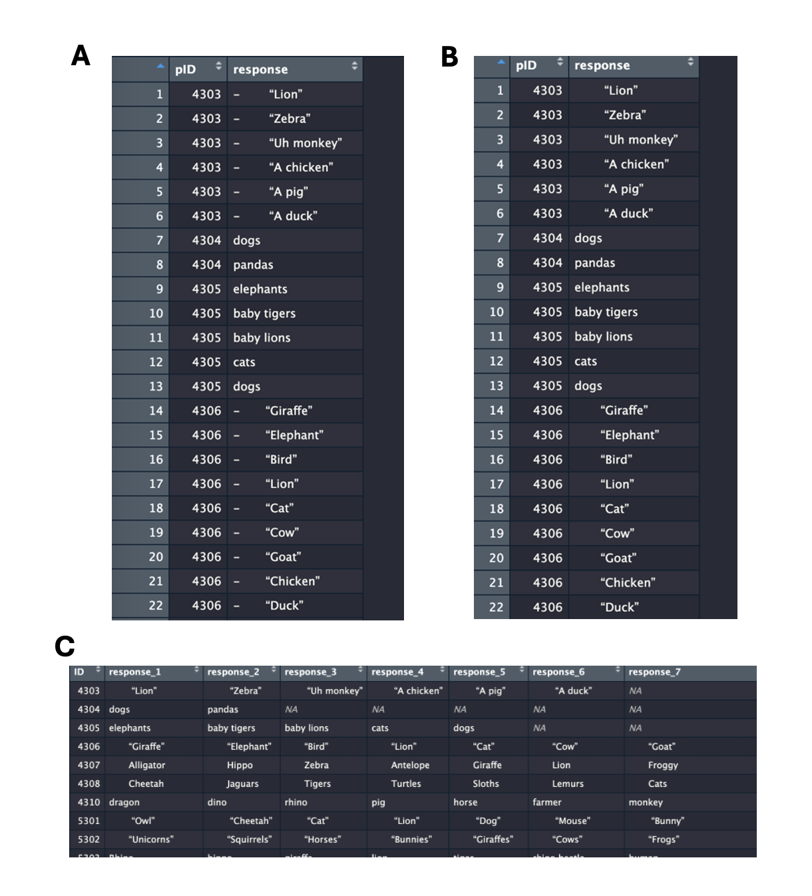
</p>

<p align="center">
  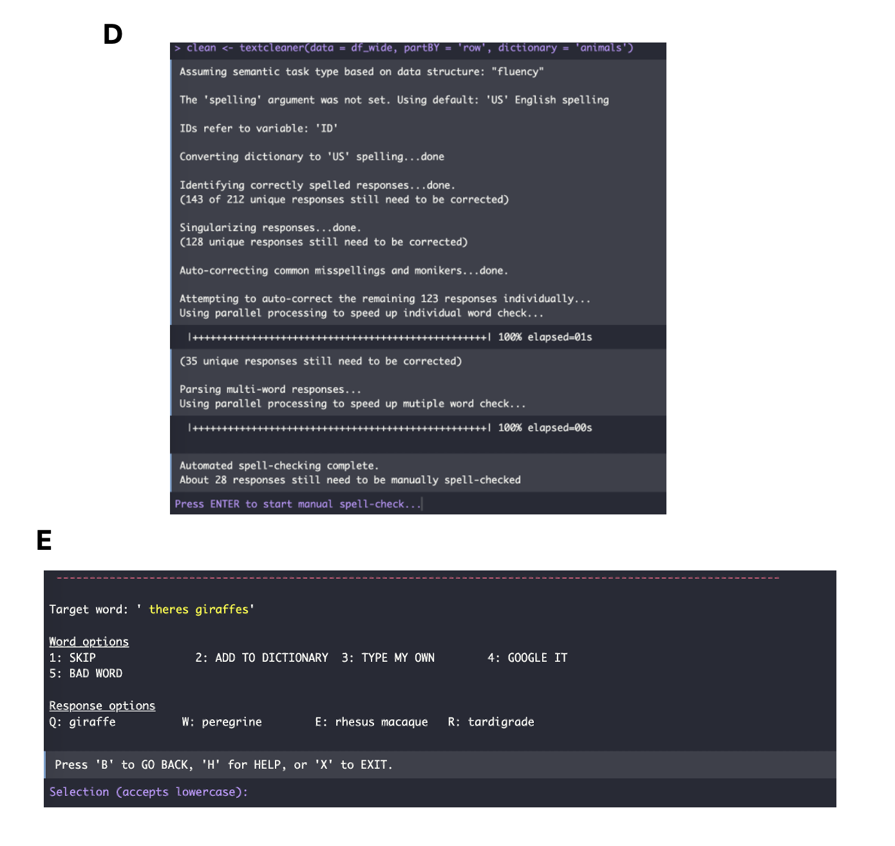
</p>

## Coding

Here's probably the most important section - how do we get helpful metrics from all this rich data? Once again, there are both manual and automated ways:

### Human raters

Typically, researchers recruit a team of 2-3 RAs to code the data. These RAs must be quasi-experts on the topic, so really make sure they know the field. I want to mention some ethical considerations here, because sometimes these datasets are super long (I had one with nearly 8000 responses) and thus are a massive task for human raters.

* **Try your best to pay them** (at least minimum wage - this isn't as hard as it seems because Duke LOVES having undergrads involved in research, so this is a very active way they can be)
* **Give them plenty of time to code** (at least 3 months)
* **Be available for questions as much as possible**
* **Provide a codebook**, see below.


#### Codebooks

Your codebook is your scripture. Give very clear definitions of themes or terms you want to code for, as informed by previous research and (I highly recommend this) pilot data. Before you give your data to RAs to code, have multiple meetings **together** to ensure they know the codebook, and give them short quizzes. Below is a codebook from my dissertation, where RAs were asked to code responses into one of 14 possible strategies. So, I had to define very clearly each strategy.

<p align="center">
  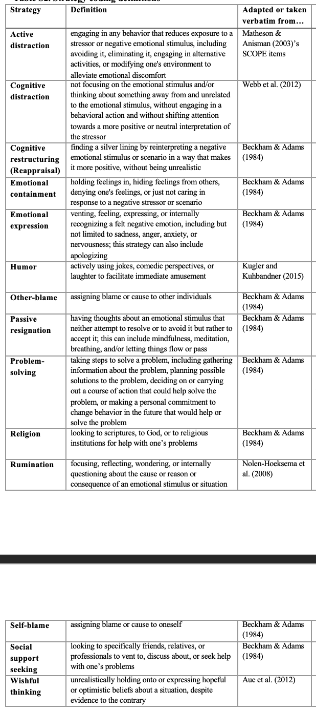
</p>

Codebooks are often theoretically informed, so really do your research about what themes you're trying to derive.


#### Reliability

Great, your raters have coded your data! Now what? The first step is to determine your **Inter-rater Reliability**. The specific statistic you use is dependent on the type of data (categorical vs numeric) and the number of raters. Here is a great paper summarizing the different techniques:
[Bajpai et al., 2015](https://www.researchgate.net/publication/273451591_Evaluation_of_Inter-Rater_Agreement_and_Inter-Rater_Reliability_for_Observational_Data_An_Overview_of_Concepts_and_Methods?enrichId=rgreq-0521fb3f42e55f2dedf3ccb9c2549b6c-XXX&enrichSource=Y292ZXJQYWdlOzI3MzQ1MTU5MTtBUzoyMDY0MDY1ODcyOTM2OTdAMTQyNjIyMjU3MzI1OQ%3D%3D&el=1_x_2&_esc=publicationCoverPdf). 

Basically, if you have nominal data (e.g., emotion regulation strategies), you will use *Cohen's Kappa* (unweighted). If you have ordinal data (e.g., education level), you will use *Cohen's Kappa (weighted)* ('weight' here means it can take into account the magnitude of the disagreements, which is not possible with just nominal data). If you have continuous data (e.g., your raters were rating how positive the statement was), you use *intra-class correlation (ICC)*. Typically, you want your agreement ratings to be $$\kappa$$ > .60 or ICC > .80. Otherwise, your codebook didn't make enough sense to your coders!

#### Aggregation

Given that you now have multiple ratings per statement (since you had multiple raters), the next step is to aggregate across raters. For categorical ratings (like my emotion regulation task), you can't just average them! You need a third party to choose the best possible option - this can be you (the lead researcher) or another new (expert) RA. If you have continuous ratings, you can simply average your responses.

### Automated rating

This is a recent development in psychology alongside technological advancements in AI and LLMs. If you're interested in this topic, you probably want to read [this PNAS paper](https://www.pnas.org/doi/10.1073/pnas.2308950121), which validated the use of GPT to code different types of qualitative data. 

#### GPT

Yep, you can access GPT (whatever model you want) with an API key to code your data. I gave GPT the same codebook for emotion regulation strategies I gave humans (with some prompt-tuning), and it corresponded with human raters at  $$\kappa$$ = .71. Pretty impressive!

Naturally, this costs money depending on the size of your dataset (divided into things called 'tokens', which is kinda somewhat equivalent to a word). GPT bills based on the number of tokens. Below you can see that a dataset of nearly 8000 rows cost about $40 (again, the exact rate depends on the model). Also depdendent on the model is the amount of time GPT takes to code. For my datatset, it took about 16 hours.

<p align="center">
  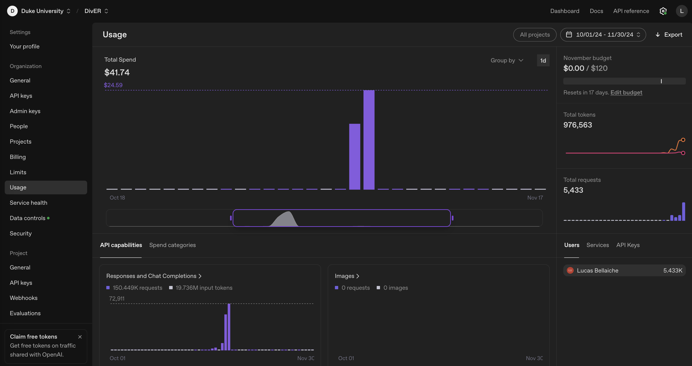
</p>

#### Some creativity automated methods

* **[OCSAI](https://openscoring.du.edu/scoringllm)** - trained on thousands of human responses on the Alternative Uses Task and can predict *originality* ratings at *r* = .81 with humans.
* **Semantic Distance** - measures the semantic distance (1-cosine similarity) between a pair of words, as trained on a huge corpus of text like Wikipedia.
* **[Divergent semantic integration](https://cap.ist.psu.edu/dsi)**- semantic distance but for phrases or narratives, validated [here](https://link.springer.com/article/10.3758/s13428-022-01986-2).


## Analysis

Finally! You have rooted your rich qualitative data into constructs of interest. Now how do you statistically measure them? Depending on the type of data your coders rated, you will use different statistical tests. Namely, with continuous data, you can use your good-ole ANOVAs or t-tests assuming you had different groups.

However, most qualitative data is done with categorical data, with thus means you have responses as **counts**, not numerics. 

### Chi-square

Very basically: Are there more counts in one group than another?

### Generalized regression models

General*ized* linear models (not "general" linear models) are regressions wherein you specify a non-normal distribution. Because we probably have count data, it is common to specify a *Poisson* distribution. If you may recall, a Poisson distribution offers the probability of a discrete outcome, where the outcome is simply the number of times something happened (e.g., a category was coded).

Because these are regression models, generalized models can thus regress individual factors (e.g., depression levels) against the number of times a certain theme/category was coded. 

```Rmd
model1 <- glmer(count ~ AUT_Avg_Originality_norm + cesd_norm + (1 | pID) + (1 | Vignette),
                data = stratcount_df,
                family = poisson)
```

<p align="center">
  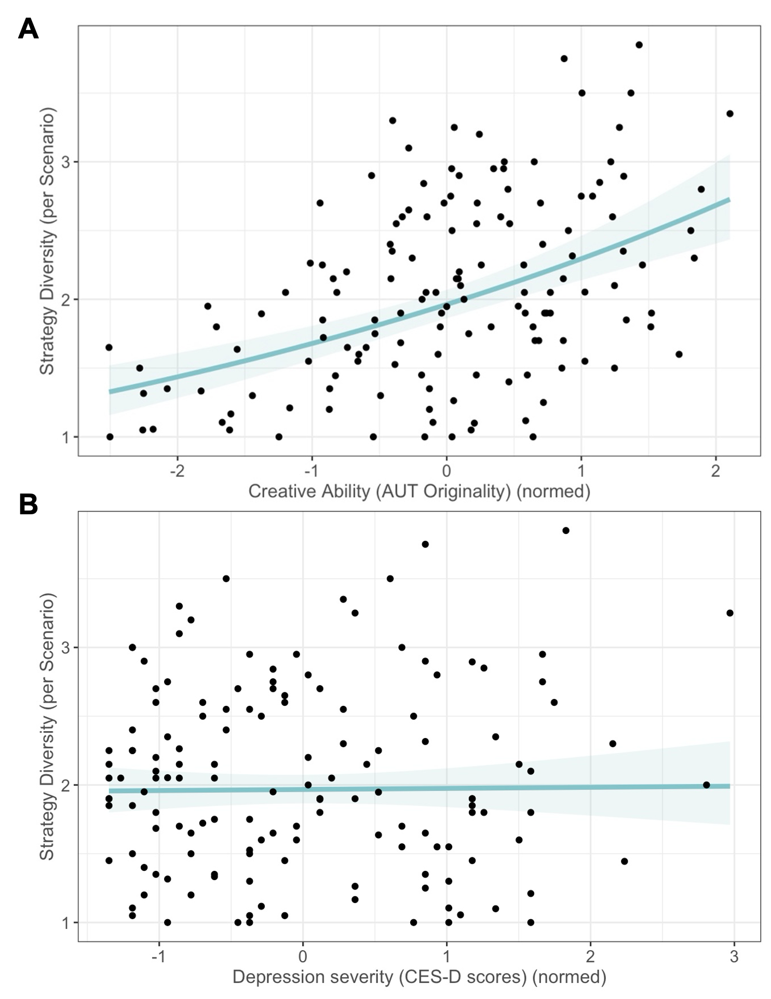
</p>

### Hurdle models

You can organize your data in a way such that each row represents each possible coded category, and the DV is 0 if the participant did not have a response that was coded in that category, or a 1 (or more) designating how many times they did have responses coded in that category. This formatting is called **zero-inflated** modeling, where you have a bunch of 0s and a few 1s or higher. This is bound to happen if you have a bunch of categories, because can't expect each participant to have generated a response corresponding to each possible category.

For example, below I have a screenshot of my emotion regulation study. For each scenario, a participant generated maybe 3 ideas, which corresponded to at most 3 strategies and at least 1. Thus, given that we coded 14 strategies in our codebook, 11-13 of these strategies have 0s.

<p align="center">
  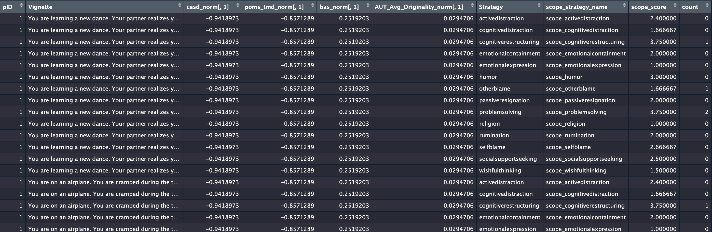
</p>

Why is this so exciting? Because there are models called **[two-part hurdle models](https://drizopoulos.github.io/GLMMadaptive/articles/ZeroInflated_and_TwoPart_Models.html)** that can adjust for this zero inflation and model very interesting aspects of thought generation. These are also regression models, so you can add predictors to determine what individual factors or experimental conditions associate with different metrics of thought generation.

```Rmd
model2_zirandom_tech <- mixed_model(count ~ Strategy*AUT_Avg_Originality_norm + Strategy*cesd_norm,
                                       random = ~ 1 || pID, 
                                        data = techcount_df, 
                                        family = hurdle.poisson(),
                                        zi_fixed = ~ Strategy*AUT_Avg_Originality_norm + Strategy*cesd_norm, 
                                        zi_random = ~1 | pID,
                                        iter_EM=0)
# ******** ---- compute joint tests for everything: how do creativity, depression interact with Strategy type to predict TechniqueCount?

joint_tests(model2_zirandom_tech, mode="fixed-effects")

# fixed effects part: 
## main effect of strategy (p<.001), creativity (p = .04)
## interaction of strategy*depression (p = .005)

joint_tests(model2_zirandom_tech, mode="zero_part")

# zero part:
## main effect of strategy (p<.001), creativity (p<.001)
## interaction between strategy*creativity (p<.001), strategy*depression (p<.001)
```

#### Zero-part

This part is a logistic regression that models the probability of whether the data point is 0 or not. Thus, in terms of interpretation, the beta here reflects the probability of generation. Conceptually, this may thus reflect if a certain coded theme is readily available to the participant: how likely were they to generate any idea at all corresponding to it? For instance, we found that more-depressed people were less likely to generate any emotion regulation idea corresponding to the reappraisal strategy and more likely to other-blame.

<p align="center">
  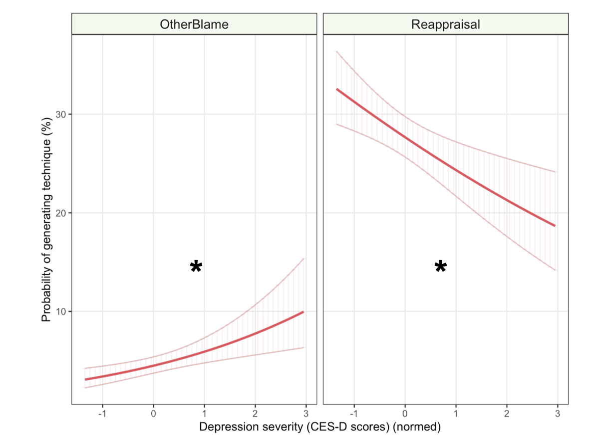
</p>

#### Fixed-effects part 

This part is a truncated-at-zero Poisson distribution that predicts the number of ideas with a beta coefficient if it is indeed non-zero. This beta thus reflects the number of generations for that category when it was "chosen".

## Summary

Qualitative data is one of the richest datatypes available to psychologists, but this can admittedly make it scary to approach. However, as summarized above, there are certain methodological pipelines and statistical analyses that, when thoughtfully combined, can offer very unique insights into participants' generative mechanisms, which may be closer to your construct of interest!
