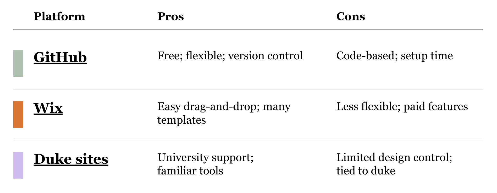

As academics, most of us would be more than happy to let our work speak for itself. But, in today's job market, we need to sell ourselves more than ever. One of the best ways to do this is through a *personal website*.

If you prefer to follow slides instead of this article, the [slides are here](https://canva.link/bxtwqgoknl8bdjb).

### Personal Website Examples

Before creating your own personal website, I find it very helpful to get inspiration from how others have designed their own websites. Here are some that I love!

- [Dorsa Amir](https://dorsaamir.com)
- [Mike Tomasello](https://miketomasello.com)
- [Adani Abutto](https://adaniabutto.com)
- [Alissa Rivero](https://alissarivero.github.io) (mine)

### Pros and Cons of Different Platforms

Building your own website can seem intimidating at first. However, you do not need a custom domain, a design degree, or a weekend lost to create your own website. There are many different, easy to use platforms, like Wix. Many universities also offer their own, in-house website-building platform (Duke's is [sites.duke.edu](https://sites.duke.edu)). GitHub also allows you to host a personal website for free.



Dorsa built her website on Wix, Mike built his on [sites.duke.edu](https://sites.duke.edu), and Adani and Alissa built theirs on GitHub.

### Tips for website building

When building your own website, here are some helpful tips to keep in mind:

1. Most people will go to your website to look for 3 things: your email, your CV, or your publications. Make them easy to find!
2. Build a website sustainably: the fewer things you need to keep up to date, the better. Also, get the homepage up and running before trying to add more.
3. Add something memorable (like the drawing component on Adani's website or the butterflies on Alissa's). More people bring up the butterflies on my website than any of the content.
4. Most importantly, any website is better than no website! Your website does not need to be perfect, it just needs to be searchable.

## Building a GitHub Website

The second part of this article walks you through a workshop I created for setting up a personal website on GitHub in just about 30 minutes.

While websites hosted on GitHub are code-based, you can follow the steps even if you have no idea how to code (thanks to AI). Using AI to code is called 'Vibe Coding', and my favorite AI coding platform is Cursor. Cursor provides 1 year of Cursor premium for free to anyone with a .edu email, and is essential to my daily workflow.

With Cursor, you should be able to set up your own publicly available platform in about 30 minutes, make changes and additions rapidly, and customize your website to an unbelievable extent.

## Walkthrough

If you are unfamiliar with any of the technical jargon in this walkthrough (or just finding yourself confused or needing to troubleshoot), I highly recommend putting my instructions / the error message into ChatGPT or Claude, and asking for step-by-step instructions. AI is very good at things like this!

By the end you should have:

- A **live site** at `https://YOUR-USERNAME.github.io`

I put together a small starter pack so you are not staring at a blank `index.html`:

[github.com/alissarivero/personal-website-template](https://github.com/alissarivero/personal-website-template)

You will clone this repository, making sure to name your repo **exactly** `YOUR-USERNAME.github.io`. This is important because this will be the URL for your website (and it is hard to change later).

Here are the step-by-step instructions for cloning a repository: On GitHub, open the starter, click **Use this template** (or **Fork**), and set the new repo name to your username plus `.github.io`. Public. Then clone *your* copy and open the folder in Cursor — the folder, not a single file.

There are five different themes available. You can click through and find the one you like best here: [alissarivero.github.io/personal-website-template](https://alissarivero.github.io/personal-website-template/)

- **Editorial** — warm, magazine-ish, a solid default
- **Midnight** — dark, compact, if you are computational (or want people to think you are)
- **Scholar** — very academic
- **Studio** — big type, color blocks
- **Letter** — one column, reads like a note, basic and clean

The homepage starts as Editorial.

### Local preview

If you ever want to preview what your website will look like, you can do so through a local preview, from a terminal in that folder:

```bash
python3 -m http.server 8080
```

Open [http://localhost:8080](http://localhost:8080). That is your homepage. The gallery of looks lives at [http://localhost:8080/gallery/](http://localhost:8080/gallery/).

To put a different look on the homepage:

```bash
./use-template.sh midnight
```

Swap `midnight` for `editorial`, `scholar`, `studio`, or `letter`. Then refresh localhost. If your computer complains about permissions, run `chmod +x use-template.sh` once and try again.

Any time you want to make a change to something in GitHub, you will want to "commit and push" your changes. Cursor is very good at doing this, and you will want to do this often as you work (GitHub essentially tracks your changes).

### Make it yours

Your public URL lives in one file, `site-config.js`:

```js
siteUrl: "https://YOUR-USERNAME.github.io",
template: "editorial"
```

Put your real username in. Set `template` to whichever look you just installed. Save.

Then actually make it yours: open the **root** `index.html` (not a file buried under `templates/` unless you are only peeking). Search the project for `TODO` and `Your Name`. Name, about, three pieces of work, email / GitHub / LinkedIn. Change the initials in `assets/images/favicon.svg` while you are at it. Refresh localhost after each burst of editing so you can see that it is, in fact, editing your website.

When it looks like you, commit by telling Cursor's agent to "commit and push" or do so manually from Cursor’s Source Control panel (or `git add` / `git commit` / `git push`). On the GitHub repo: **Settings → Pages → Deploy from a branch → `main` / `/ (root)`**. Wait a minute. Then open:

`https://YOUR-USERNAME.github.io`

The first publish 404s often. Wait another minute. Hard-refresh. It is usually just GitHub Pages stretching.

If you want the click-by-click version with the “I have never cloned a repo in Cursor” screenshots-in-prose, that lives in [WALKTHROUGH.md](https://github.com/alissarivero/personal-website-template/blob/main/WALKTHROUGH.md) in the starter.

### Nifty tricks / things that will get you

- **You cloned my repo, not yours.** If the URL still says `alissarivero/personal-website-template`, you are editing the original. Make a template copy under your account and open that.

- **The repo is still named `personal-website-template`.** Rename it on GitHub to `YOUR-USERNAME.github.io`. That name is the whole URL trick.

- **GitHub says the name is taken.** You already have a user site. Do not make a second one. Put these files in the existing `YOUR-USERNAME.github.io` repo (or replace what is there if that site is abandoned).

- **You edited a file under `templates/` and the homepage did not change.** The live page is the root `index.html`. Run `./use-template.sh NAME` to copy a look onto the homepage, *then* edit that root file.

- **Pages is on and you still see a 404.** Confirm the source is `main` and `/ (root)`, wait two minutes, hard-refresh. GitHub is slow the first time, then fine.

- **You want a custom domain later.** Fine. Do it later. Get `yourusername.github.io` working first so you have something to point a domain *at*.

### Takeaways

It is relatively easy to restyle later. It is much harder to keep promising yourself you will “make a site over winter break.” Put a real URL on the internet this week, then make it nicer when a paper actually gets accepted.

AI is your friend, and building a website on GitHub is easier than ever because of it.

Questions, corrections, or want help/advice? Feel free to reach out at <a href="mailto:alissa.rivero@duke.edu">alissa.rivero@duke.edu</a>.
